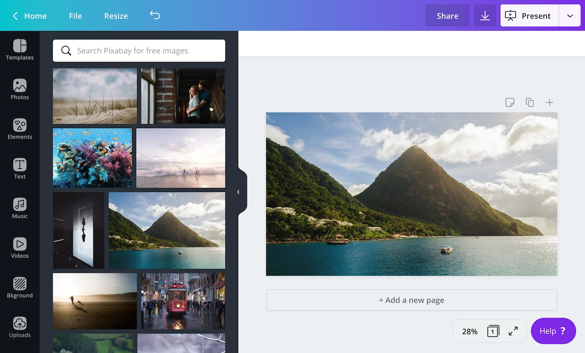

:::note  
 This topic provides an overview of what content extensions are and how they work. If you'd like to create a content extension, check out [the quick start guide](./content-extensions/quick-start.md).  
:::

There are three types of _extensions_ a developer can add to a Canva app:

- [content]()
- [editing](./editing-extensions.md)
- [publish](./publish-extensions.md)

The purpose of a _content extension_ is to provide users with third-party content via the Canva editor's side panel. Users can then drag this content into their designs.



These are some examples of content extensions:

- Bitmoji
- HubSpot
- Pixabay

You can find more examples at [canva.com/apps](https://canva.com/apps).

## What type of content is supported?

A content extension can provide users with two types of content:

- [images](./content-extensions/images.md), such as JPEG, PNG, and SVG files.
- [embeds](./content-extensions/embeds.md), such as YouTube videos or Instagram photos.

:::note  
 A content extension can't provide users with images _and_ embeds. It must be one or the other.  
:::

## How content extensions work

At its most basic, a content extension is a REST API.

It doesn't matter what language or framework is used to create this API. All that matters is that Canva sends requests to certain routes and expects to receive responses in a format that it understands.

At a minimum, all content extensions must support the [`/content/resources/find`](./content-extensions/api/post-content-resources-find.md) route.

## Example

This is an example of a content extension that retrieves an image from [Lorem Picsum](https://picsum.photos/):

```javascript
const express = require("express");
const app = express();

app.use(express.json());

app.post("/content/resources/find", async (request, response) => {
  response.send({
    type: "SUCCESS",
    resources: [
      {
        type: "IMAGE",
        id: "123456",
        name: "Flowers",
        thumbnail: {
          url: "https://i.picsum.photos/id/152/500/333.jpg",
          width: 500,
          height: 333,
        },
        url: "https://i.picsum.photos/id/152/3888/2592.jpg",
        contentType: "image/jpeg",
      },
    ],
  });
});

app.listen(process.env.PORT || 3000);
```

To learn how to create this extension from scratch, check out [the quick start guide](./content-extensions/quick-start.md).
