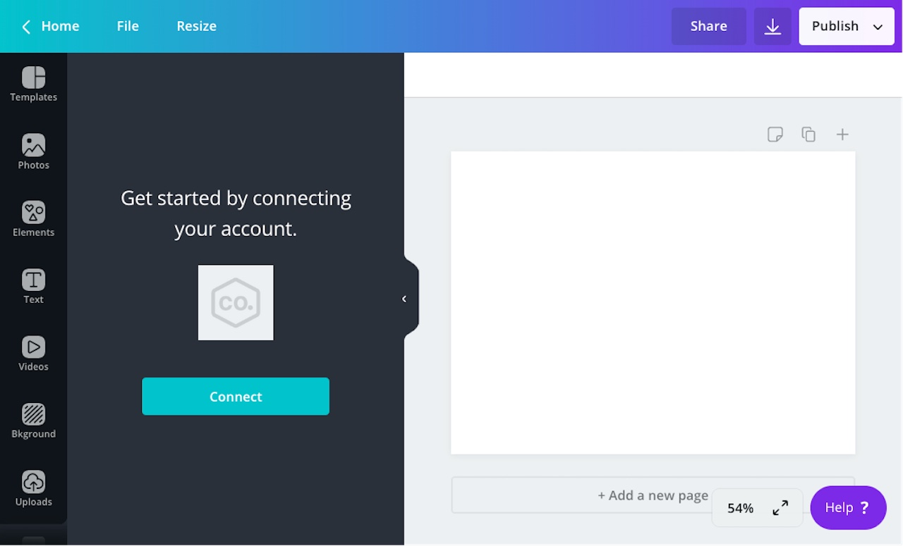
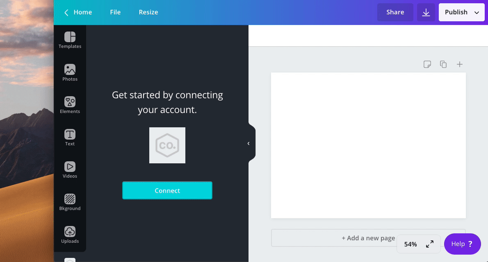

You can configure a [content extension](./../content-extensions.md) to support authentication. This allows Canva's users to access content that isn't publicly accessible, such as private content from their social media account.

Some examples of content extensions that support authentication include:

- Bitmoji
- Google Photos
- Pinterest

:::note  
 You can also configure a [publish extension](./../publish-extensions.md) to support authentication, but the implementation is slightly different. For more information, refer to [Authentication for publish extensions](./../publish-extensions/authentication.md).  
:::

## Enabling authentication

By default, apps don't support authentication. You need to enable the feature.

To enable authentication:

1.  Navigate to an app via the Developer Portal.
2.  Select **Verification & auth**.
3.  Toggle **This app requires authentication** to the _on_ position.

When authentication is enabled, the following fields are required:

- Redirect URL
- Authentication status endpoint URL

The purpose and usage of the **Redirect URL** field is explained later in this topic.

The **Authentication status endpoint URL** field is only used for publish extensions, but the form won't save if the field is empty. If your app doesn't have a publish extension, enter a dummy value into the field, such as `https://example.com`.

## Understanding the authentication flow

Canva treats authentication as a black box. You can design your app to support _any_ type of authentication method, including (but not limited to):

- username and passwords
- OAuth 2.0
- QR codes

Canva only imposes a few requirements at the start and end of the authentication flow. Whatever happens in the middle is completely under your control.

The best way to understand authentication is to take a step-by-step walk-through of an entire authentication flow. Then you'll have a clear idea of how each moving part comes together to form an authentication flow.

### Step 1: The user opens a content extension

When a user opens a content extension, Canva sends a `POST` request to the following endpoint:

```shell
<endpoint_url>/content/resources/find
```

The body of this request includes a `user` property that contains the ID of the user:

```json
{
  "user": "AUQ2RUzug9pEvgpK9lL2qlpRsIbn1Vy5GoEt1MaKRE=",
  "brand": "AUQ2RUxiRj966Wsvp7oGrz33BnaFmtq4ftBeLCSHf8=",
  "label": "CONTENT",
  "limit": 100,
  "type": "IMAGE",
  "locale": "en-US"
}
```

In a later step, we'll discuss how the app can use the user's ID to check if the user is authenticated. For the time being though, let's assume the user is not authenticated.

### Step 2: If the user is not authenticated, the extension returns a `"CONFIGURATION_REQUIRED"` error

When a user is not authenticated, an extension should return an `"ERROR"` response with an `errorCode` of `"CONFIGURATION_REQUIRED"`:

```json
{
  "type": "ERROR",
  "errorCode": "CONFIGURATION_REQUIRED"
}
```

This tells Canva to render a **Connect** button in the side panel.



### Step 3: The user clicks the **Connect** button

When a user clicks the **Connect** button, Canva opens a pop-up window.



Inside this pop-up window, Canva redirects the user to the app's **Redirect URL**. You can set the app's **Redirect URL** via the **Verification & auth** page.

The **Redirect URL** should point to a page that allows the user to authenticate. This page could contain:

- a login form with a username and password field
- the start of an OAuth 2.0 authorization flow
- a QR code that the user can scan with their phone

...or any other authentication method.

### Step 4: Canva appends query parameters to the **Redirect URL**

If you look at the address bar in the pop-up window, you'll notice that Canva appends a number of query parameters to the **Redirect URL**:

| Name         | Type   | Required | Description |
| ------------ | ------ | -------- | ----------- |
| `helloWorld` | string | <Tick /> |             |

All of these parameters serve an important purpose.

When Canva redirects the user to the **Redirect URL**, it sends a `GET` request to the **Redirect URL**. For the app to be approved for release, it must verify the authenticity of this request to ensure that it's actually sent from Canva (and not from some nefarious third-party). The values of the query parameters are required as part of this verification process. To learn more, refer to [Verifying `GET` requests](./../verifying-requests/#verifying-get-requests.md).

The `state` parameter is a unique ID for the authentication flow that needs to be returned to Canva at the end of the flow. This is a security measure to defend against [Cross-site request forgery](https://en.wikipedia.org/wiki/Cross-site_request_forgery) (CSRF) attacks. You'll see how to return the `state` parameter to Canva in a later step.

If the user successfully authenticates, the app needs to persist the user's ID to a data store. This will allow the app to check if the user is authenticated when the user returns to the app. The user's ID is available via the `user` parameter.

### Step 5: The user navigates through the app's authentication flow

As explained earlier, this is the part of the process that Canva treats as a black box. The app has complete control over the page(s) within the pop-up window, so how users navigate through part of the flow depends entirely on the app.

### Step 6: When the user successfully authenticates, the app stores whatever data it requires to identify the user in the future

At a minimum, the app needs to store the ID of the user to identify them when they return to the app. It doesn't matter how this data is stored, as long as it's stored securely and the app can query for it when the user returns to the app.

If an app integrates with a platform that requires additional data for authentication, such as an authentication token, the app is also responsible for storing that data.

### Step 7: The app redirects the user back to Canva

When the user has finished authenticating, the app needs to redirect users back to the following URL from within the pop-up window:

```shell
https://canva.com/apps/configured?success=true&state=<state_goes_here>
```

You must append the following query parameters to this URL:

| Name         | Type   | Required | Description |
| ------------ | ------ | -------- | ----------- |
| `helloWorld` | string | <Tick /> |             |

If the user has successfully authenticated, the `success` parameter must be `true`.

The `state` parameter must contain the value of the `state` parameter that Canva provided at the start of the authentication flow. This confirms the authenticity of the authentication flow.

After redirecting to this URL, Canva will close the pop-up window and reload the content extension.

:::note  
 If you set the `success` parameter to `false`, Canva will close the pop-up window but not reload the content extension. This means the button will remain visible in the side panel.  
:::

### Step 8: The app loads the authenticated user's content

When Canva reloads the content extension, it sends another request to the following endpoint:

```shell
<endpoint_url>/content/resources/find
```

This endpoint will need to use the user's ID to query the app's data store and check if the user is authenticated. If they are, it can return the content that belongs to that user.

If the user is not authenticated, the app should return the `"CONFIGURATION_REQUIRED"` error:

```json
{
  "type": "ERROR",
  "errorCode": "CONFIGURATION_REQUIRED"
}
```

This will, once again, render the **Connect** button that allows the user to begin the authentication flow.
