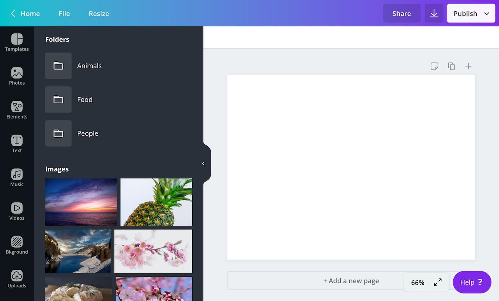
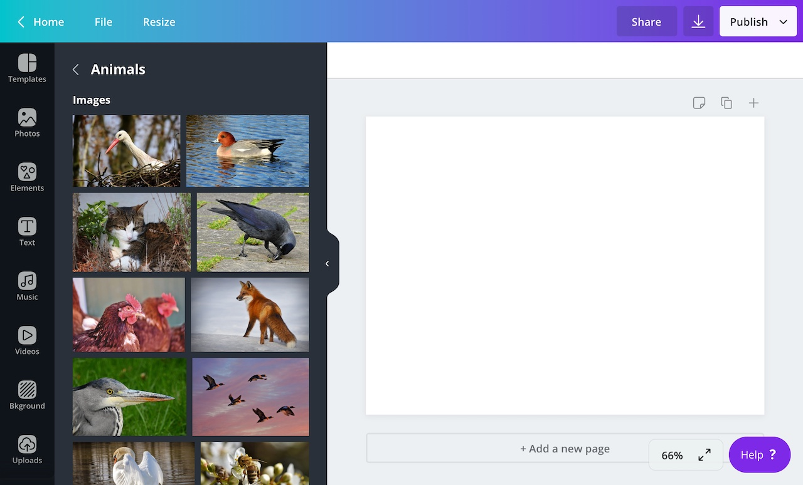

In a content extension, images can be organized into _containers_. A container is essentially a folder that users can open to view specific content.



This topic explains how a content extension can be configured to support containers.

:::note  
 Only images -- not [embeds](./embeds.md) -- can be organized into containers.  
:::

## Enabling containers

For a content extension to support containers, it must be configured via the Developer Portal.

To enable support for containers:

1.  Navigate to an app in the Developer Portal.
2.  From the **Extensions** page, expand the **Content** panel.
3.  From the **Asset type** dropdown, select **Image and folder**.

## Receiving container requests

When a content extension supports containers, Canva will send two `POST` requests to the following URL:

```bash
<endpoint_url>/content/resources/find
```

The first request is an `"IMAGE"` request:

```json
{
  "user": "AVnWYDnv7TtPvDSMSvngaIJP6plu860IYLU3rbCfGJ0=",
  "brand": "AVnWYDnOvjpbzV2-Rax9bSeEAIw3cEI6onnyvyDf5ac=",
  "label": "CONTENT",
  "limit": 8,
  "locale": "en-GB",
  "type": "IMAGE"
}
```

This is the same request that's described in the [Images](./images.md) topic. Your extension should respond to the `"IMAGE"` request with the images that will appear in the side panel.

The second request is a `"CONTAINER"` request:

```json
{
  "user": "AVnWYDnv7TtPvDSMSvngaIJP6plu860IYLU3rbCfGJ0=",
  "brand": "AVnWYDnOvjpbzV2-Rax9bSeEAIw3cEI6onnyvyDf5ac=",
  "label": "CONTENT",
  "limit": 8,
  "locale": "en-GB",
  "type": "CONTAINER"
}
```

Your extension should respond to the `"CONTAINER"` request with the containers that will appear in the side panel.

Because Canva sends both requests to the same endpoint, your extension will need to distinguish between them and provide different responses. This is an example of how you might do that with Express.js:

```javascript
const express = require("express");
const app = express();

app.use(express.json());

app.post("/content/resources/find", async (request, response) => {
  if (request.body.type === "IMAGE") {
    // Handle the "IMAGE" request
  }

  if (request.body.type === "CONTAINER") {
    // Handle the "CONTAINER" request
  }
});

app.listen(process.env.PORT || 3000);
```

:::note  
 The only difference between an `"IMAGE"` and `"CONTAINER"` request is the value of the `type` property.  
:::

## Responding to container requests

After receiving a `"CONTAINER"` request, a content extension should return a `"SUCCESS"` response that includes the containers that will appear in the side panel.

The body of this response must contain the following properties:

| Name         | Type   | Required | Description |
| ------------ | ------ | -------- | ----------- |
| `helloWorld` | string | <Tick /> |             |

Each object in the `resources` array must contain the following properties:

| Name         | Type   | Required | Description |
| ------------ | ------ | -------- | ----------- |
| `helloWorld` | string | <Tick /> |             |

You can use the `thumbnail` property to (optionally) assign a thumbnail to the container:

| Name         | Type   | Required | Description |
| ------------ | ------ | -------- | ----------- |
| `helloWorld` | string | <Tick /> |             |

This is an example of a `"SUCCESS"` response:

```json
{
  "type": "SUCCESS",
  "resources": [
    {
      "type": "CONTAINER",
      "id": "myContainer",
      "name": "My Container"
    }
  ]
}
```

## Detecting when a user opens a container

When a user opens a container, Canva sends another two `POST` requests `/content/resources/find`. These are the same `"IMAGE"` and `"CONTAINER"` requests mentioned above, except for the fact that they also include a `containerId` property:

```json
{
  "user": "AVnWYDnv7TtPvDSMSvngaIJP6plu860IYLU3rbCfGJ0=",
  "brand": "AVnWYDnOvjpbzV2-Rax9bSeEAIw3cEI6onnyvyDf5ac=",
  "label": "CONTENT",
  "limit": 8,
  "locale": "en-GB",
  "type": "CONTAINER",
  "containerId": "myContainer"
}
```

This `containerId` property contains the `id` of the opened container.

When a `POST` request is _not_ triggered by opening a container, the `containerId` property is `null`. You can therefore detect when a user has opened a container by checking if the `containerId` property is `null`:

```javascript
app.post("/content/resources/find", async (request, response) => {
  if (request.body.containerId) {
    // the user has opened a container
  }

  if (!request.body.containerId) {
    // the user has not opened a container
  }
});
```

If the `containerId` property is not `null`, an extension should respond to requests with resources that belong to the opened container. In response to an `"IMAGE"` request, this would be images that belong to the container. In response to a `"CONTAINER"` request, this would be child containers.



:::tip  
 Canva doesn't impose any limits on how deeply containers can be nested within containers, but deep hierarchies can be difficult to navigate. As an alternative, consider [adding search](./search.md) to your extension.  
:::

## Handling search queries

If an extension supports search queries, it's important to know that the `query` and `containerId` properties are mutually exclusive. If the `query` property is not `null`, then the `containerId` will be `null`. This means a user cannot search within a container. You can, however, use a search query to return a filtered list of containers.

## Example

This example retrieves photos from [Pixabay](https://pixabay.com) and organizes them into containers.

```javascript
const axios = require("axios");
const express = require("express");
const app = express();

app.use(express.json());

app.post("/content/resources/find", async (request, response) => {
  // Handle "CONTAINER" requests
  if (request.body.type === "CONTAINER") {
    // The user has opened a container
    if (request.body.containerId) {
      response.send({
        type: "SUCCESS",
        resources: [],
      });
    }

    // The user has not opened a container
    if (!request.body.containerId) {
      response.send({
        type: "SUCCESS",
        resources: [
          {
            type: "CONTAINER",
            id: "animals",
            name: "Animals",
          },
          {
            type: "CONTAINER",
            id: "food",
            name: "Food",
          },
          {
            type: "CONTAINER",
            id: "people",
            name: "People",
          },
        ],
      });
    }
  }

  // Handle "IMAGE" requests
  if (request.body.type === "IMAGE") {
    // Configure the request
    const options = {
      url: "https://pixabay.com/api/",
      params: {
        key: process.env.PIXABAY_API_KEY,
      },
    };

    // The user has opened a container
    if (request.body.containerId) {
      options["params"]["category"] = request.body.containerId;
    }

    // Make the request
    const pixabay = await axios.request(options);

    // Transform the array of images into an array of image resources
    const images = pixabay.data.hits.map((image) => {
      return {
        type: "IMAGE",
        id: image.id,
        name: `Photo by ${image.user}`,
        thumbnail: {
          url: image.webformatURL,
          height: image.webformatHeight,
          width: image.webformatWidth,
        },
        url: image.webformatURL,
        contentType: "image/jpeg",
      };
    });

    // Provide a success response
    response.send({
      type: "SUCCESS",
      resources: images,
    });
  }
});

app.listen(process.env.PORT || 3000);
```
