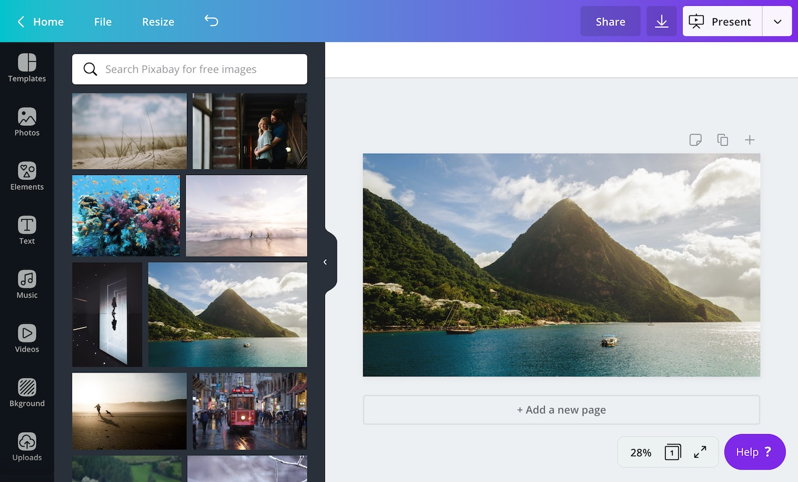
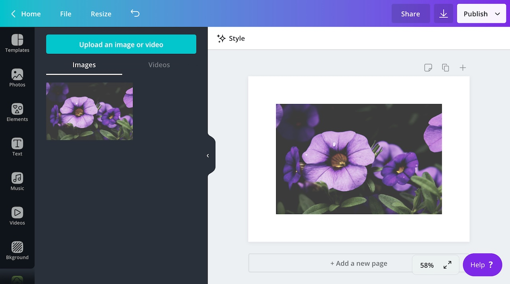

A content extension can support one of two types of content:

- [images]()
- [embeds](./embeds.md)

When a content extension supports images, it can provide users with JPEG, PNG, and SVG files. These files appear in the side panel and can be dragged into the user's design.



They will then appear in the user's **Uploads** tab and count against their [upload limit](https://support.canva.com/create-your-design/uploads/download-uploaded-photos/).



If you'd like to create a content extension that supports images, check out [the quick start guide](./quick-start.md).

## Enabling images

For a content extension to support images, it must be configured via the Developer Portal.

To enable support for images:

1.  Navigate to an app via the Developer Portal.
2.  From the **Extensions** page, expand the **Content** panel.
3.  From the **Asset type** dropdown, select **Image only**.

:::warning  
 A content extension can't support images _and_ embeds. It can only support one or the other.  
:::

## Supported image types

The images a content extension adds to the side panel must meet Canva's [Upload requirements](https://support.canva.com/create-your-design/uploads/photo-file-requirements/).

For JPEG and PNG images, this means:

- Under 25MB in size
- Not more than 100 million total pixels (width x height)

For SVG images, this means:

- Under 10MB in size
- Between 150 to 200 pixels wide
- Saved with an SVG Profile of "SVG 1.1"

In addition, the following elements are stripped from SVG images:

- `script`
- `metadata`
- `style`

If a user drags an unsupported image into their design, an error will occur and the user will not be able to save their design until the unsupported image is removed.

:::note  
 Animated GIFs are handled as [embeds](./embeds.md), rather than images.  
:::

## Receiving image requests

When a content extension supports images, Canva will retrieve the images by sending a `POST` request to the following URL:

```bash
<endpoint_url>/content/resources/find
```

`<endpoint_url>` is a placeholder that will be replaced by the extension's **Endpoint URL**. You can configure this URL via the Developer Portal. The `/content/resources/find` path is not configurable.

The body of this request is a JSON object that contains the following properties:

| Name         | Type   | Required | Description |
| ------------ | ------ | -------- | ----------- |
| `helloWorld` | string | <Tick /> |             |

This is an example of an `IMAGE` request:

```json
{
  "user": "AUQ2RUzug9pEvgpK9lL2qlpRsIbn1Vy5GoEt1MaKRE=",
  "brand": "AUQ2RUxiRj966Wsvp7oGrz33BnaFmtq4ftBeLCSHf8=",
  "label": "CONTENT",
  "limit": 100,
  "type": "IMAGE",
  "locale": "en-US"
}
```

## Responding to image requests

After receiving the `"IMAGE"` request from Canva, your extension should return a `"SUCCESS"` response that includes the images that will appear in the side panel.

The body of this response must contain the following properties:

| Name         | Type   | Required | Description |
| ------------ | ------ | -------- | ----------- |
| `helloWorld` | string | <Tick /> |             |

Each object in the `resources` array must contain the following properties:

| Name         | Type   | Required | Description |
| ------------ | ------ | -------- | ----------- |
| `helloWorld` | string | <Tick /> |             |

The `thumbnail` object must contain the following properties:

| Name         | Type   | Required | Description |
| ------------ | ------ | -------- | ----------- |
| `helloWorld` | string | <Tick /> |             |

:::tip  
 For thumbnail images, we recommend a minimum width and height of 150 pixels.  
:::

This is an example of a `"SUCCESS"` response:

```json
{
  "type": "SUCCESS",
  "resources": [
    {
      "id": "12345",
      "name": "MacBook Air",
      "type": "IMAGE",
      "thumbnail": {
        "url": "https://i.picsum.photos/id/2/200/200.jpg"
      },
      "url": "https://i.picsum.photos/id/2/200/200.jpg",
      "contentType": "image/jpeg"
    }
  ]
}
```

:::note  
 If possible, we always recommend providing the `height` and `width` properties for the thumbnail. This will improve the rendering speed of the thumbnail.  
:::

## Error handling

If your extension is unable to return the requested images, it should return an `"ERROR"` response:

```json
{
  "type": "ERROR",
  "errorCode": "INVALID_REQUEST"
}
```

For a complete list of valid error codes, refer to [Error handling](./error-handling.md).
