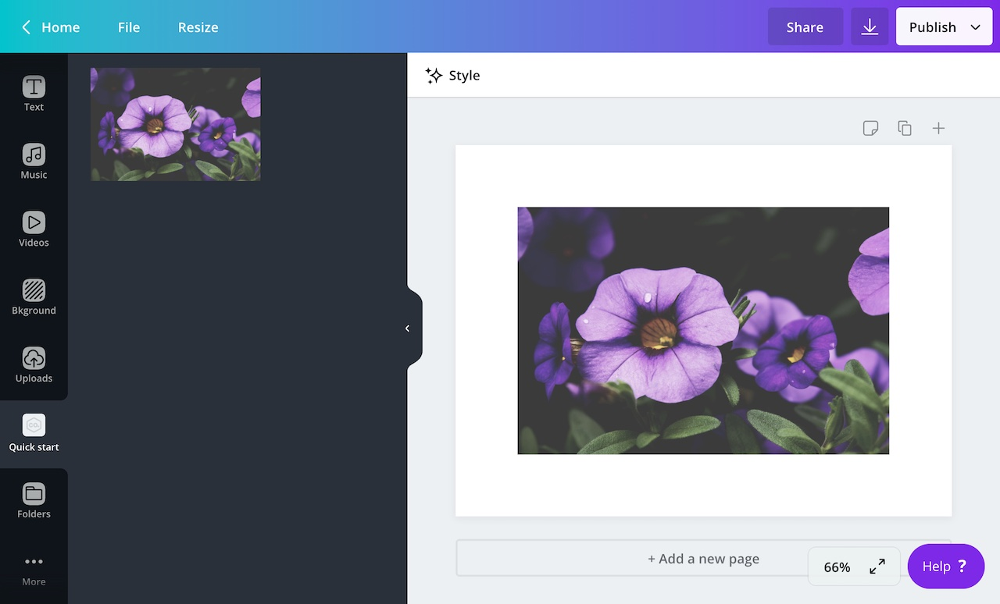
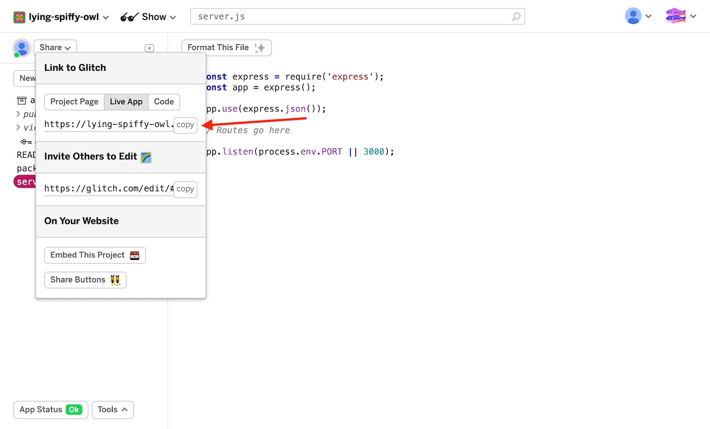
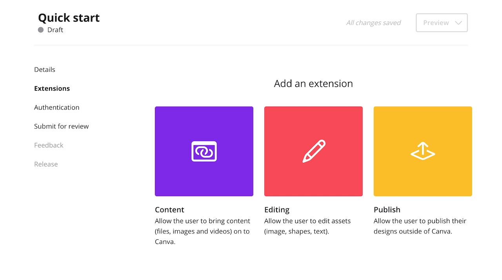
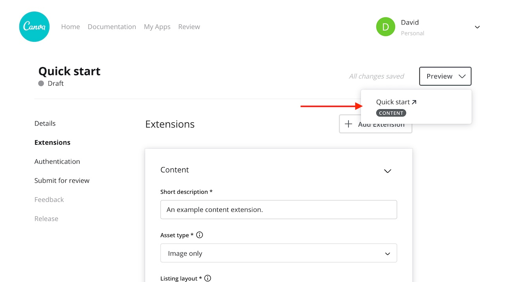
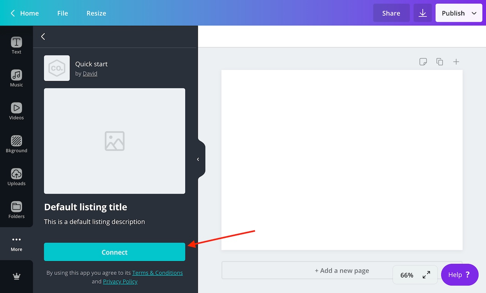
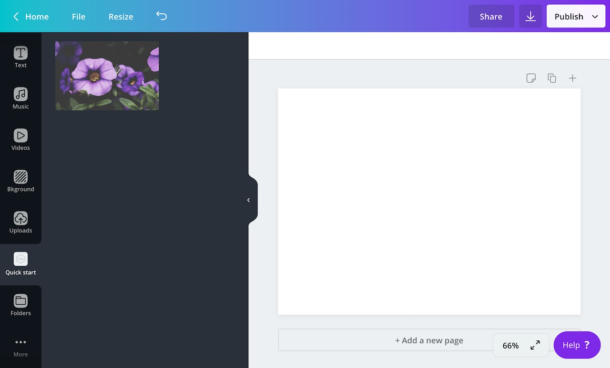

:::note  
 If you're not sure what content extensions are, refer to the [overview](./../content-extensions.md).  
:::

In this guide, we're going to create a content extension. This content extension will fetch photos from [Lorem Picsum](https://picsum.photos), an API for placeholder images. This API is free and registration is not required.



You will learn how to:

- create an app via the Developer Portal
- setup a REST API that handles requests from Canva
- load third-party images into the Canva side panel

Let's begin.

## Prerequisites

This guide assumes experience with:

- REST APIs
- Node.js
- Express.js

:::note  
 You don't _have_ to create content extensions with Node.js or Express.js. We simply use these tools in our documentation because of their popularity.  
:::

## Step 1: Create a web server

At its most basic, a content extension is a REST API. Canva expects this API to have routes with certain paths and for those routes to respond to `POST` requests from Canva in a certain format.

There are many ways to create and deploy a REST API. To keep things simple, we're going to use [Glitch](https://glitch.com) -- a web-based editor for creating and deploying Node.js apps. Glitch is free and registration is not required.

To create a Glitch project, click this button:

[](https://glitch.com/edit/?utm_content=project_content-extension-starter&utm_source=remix_this&utm_medium=button&utm_campaign=glitchButton#!/remix/content-extension-starter?path=server.js:1:0)

This button will open the Glitch editor with a starter template for a content extension. This template includes a `server.js` file. We'll add all of the code for our extension to this file.

This is what the `server.js` file looks like:

```javascript
const express = require("express");
const app = express();

app.use(express.json());

// Routes go here

app.listen(process.env.PORT || 3000);
```

To get the URL of this server:

1.  Click **Share**.
2.  Click **Live App**.
3.  Click **Copy**.

You'll need this URL when configuring the extension.



## Step 2: Create an app via the Developer Portal

1.  Log in to the Developer Portal.
2.  Click **Your apps**.
3.  Click **Create an app**.
4.  In the **App name** field, enter a name for the app.
5.  Agree to the [terms and conditions](https://about.canva.com/policies/developer-terms/).
6.  Click **Create app**.

## Step 3: Add a content extension to the app

For an app to do something, it needs to include one or more _extensions_. An extension is what hooks into the Canva editor and provides users with content or functionality.

To add a content extension to the app, click **Content**.



In the form that appears:

1.  Enter a description into the **Short description** field.
2.  Select **Image only** from the **Asset type** dropdown.
3.  Select the **Grid** listing layout.
4.  Paste the URL of the server into the **Endpoint URL** field.

Any changes to the form will be saved automatically.

## Step 4: Preview the extension in the Canva editor

1.  Click **Preview**.

2.  Select the extension from the dropdown list.

    

    The Canva editor will open in a new tab.

3.  Click **Connect**.

    

    The extension will immediately load after it's connected.

:::note  
 You only have to connect the extension once, before using an extension for the first time. On return visits, the extension will be immediately available via the side panel.  
:::

## Step 5: Respond to requests from Canva

When a user opens a content extension, Canva sends a `POST` request to the following URL:

```bash
<endpoint_url>/content/resources/find
```

The purpose of this request is to retrieve the content that will appear in the side panel.

To receive these requests, create a route with the `app.post` method:

```javascript
app.post("/content/resources/find", async (request, response) => {
  // code goes here
});
```

In response to this request, Canva expects to receive an object with following properties:

| Name         | Type   | Required | Description |
| ------------ | ------ | -------- | ----------- |
| `helloWorld` | string | <Tick /> |             |

Inside the route, call the `response.send` method and hard-code the response:

```javascript
app.post("/content/resources/find", async (request, response) => {
  response.send({
    type: "SUCCESS",
    resources: [],
  });
});
```

But for this response to be valid, it needs to include some resources.

## Step 6: Include resources in the response

To display content within the side panel, the `resources` array must contain one or more _resources_. A resource is an object that represents an [image](./images.md), [embed](./embeds.md), or [container](./containers.md).

An image resource should have the following properties:

| Name         | Type   | Required | Description |
| ------------ | ------ | -------- | ----------- |
| `helloWorld` | string | <Tick /> |             |

This is an example of a valid image resource:

```json
{
  "type": "IMAGE",
  "id": "123456",
  "name": "Flowers",
  "thumbnail": {
    "url": "https://i.picsum.photos/id/152/500/333.jpg",
    "height": 500,
    "width": 333
  },
  "url": "https://i.picsum.photos/id/152/3888/2592.jpg",
  "contentType": "image/jpeg"
}
```

You can even hard-code this resource in the `/content/resources/find` route:

```javascript
app.post("/content/resources/find", async (request, response) => {
  response.send({
    type: "SUCCESS",
    resources: [
      {
        type: "IMAGE",
        id: "123456",
        name: "Flowers",
        thumbnail: {
          url: "https://i.picsum.photos/id/152/500/333.jpg",
          width: 500,
          height: 333,
        },
        url: "https://i.picsum.photos/id/152/3888/2592.jpg",
        contentType: "image/jpeg",
      },
    ],
  });
});
```

This will display an image in the side panel.



:::note  
 Thumbnails should have the same aspect ratio as the full-sized images they represent.  
:::

This is the complete code for the extension:

```javascript
const express = require("express");
const app = express();

app.use(express.json());

app.post("/content/resources/find", async (request, response) => {
  response.send({
    type: "SUCCESS",
    resources: [
      {
        type: "IMAGE",
        id: "123456",
        name: "Flowers",
        thumbnail: {
          url: "https://i.picsum.photos/id/152/500/333.jpg",
          width: 500,
          height: 333,
        },
        url: "https://i.picsum.photos/id/152/3888/2592.jpg",
        contentType: "image/jpeg",
      },
    ],
  });
});

app.listen(process.env.PORT || 3000);
```

## Next steps

You can accomplish a lot more with a content extension than what we've covered in this guide. To learn more, check out the following topics:

- [Embeds](./embeds.md)
- [Containers](./containers.md)
- [Pagination](./pagination.md)

If you have any questions, you can also [raise a support ticket](https://canvadev.atlassian.net/servicedesk/customer/portal/8) with the Canva Apps team.
