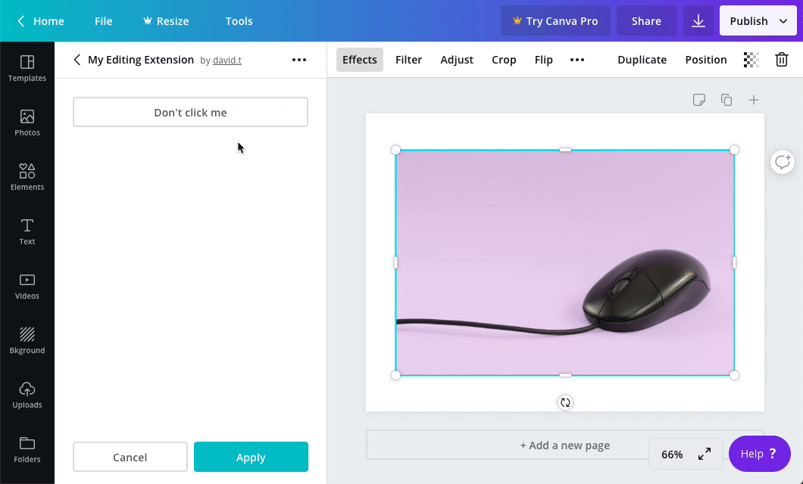

## Usage

```javascript
canva.create("button", {
  id: "buttonExample",
  label: "Button Example",
});
```

## Properties

| Property | Type   | Required | Description                            |
| -------- | ------ | :------: | -------------------------------------- |
| `id`     | string | <Tick /> | A unique ID for the button.            |
| `label`  | string | <Tick /> | A human readable label for the button. |

## Events

When a user clicks a button, the `onControlsEvent` callback is executed:

```javascript
canva.onControlsEvent(async (opts) => {
  console.log(opts.message);
  // {
  //   commit: true,
  //   controlId: "buttonExample",
  //   controlType: "button",
  //   message: {
  //     type: "click"
  //   }
  // }
});
```

This callback receives an object with the following properties:

| Parameter | Type   | Description                  |
| --------- | ------ | ---------------------------- |
| `message` | object | Information about the event. |

The `message` object contains the following properties:

| Property      | Type    | Description                                                                                                                                                                                      |
| ------------- | ------- | ------------------------------------------------------------------------------------------------------------------------------------------------------------------------------------------------ |
| `commit`      | boolean | This value is `false` while the user is interacting with the control and `true` when they have finished interacting with the control. For a button, the value of this property is always `true`. |
| `controlId`   | string  | The ID of the control.                                                                                                                                                                           |
| `controlType` | string  | The type of control. For a button, the value of this property is always `"button"`.                                                                                                              |
| `message`     | object  | Additional information about the event.                                                                                                                                                          |

The inner `message` object contains the following properties:

| Property | Type   | Description                                                                      |
| -------- | ------ | -------------------------------------------------------------------------------- |
| `type`   | string | The type of event. For a button, the value of this property is always `"click"`. |

## Example

```javascript
const canva = window.canva.init();

const renderControls = () => {
  const controls = [
    canva.create("button", {
      id: "buttonExample",
      label: "Button Example",
    }),
  ];
  canva.updateControlPanel(controls);
};

canva.onReady(() => {
  renderControls();
});
```
