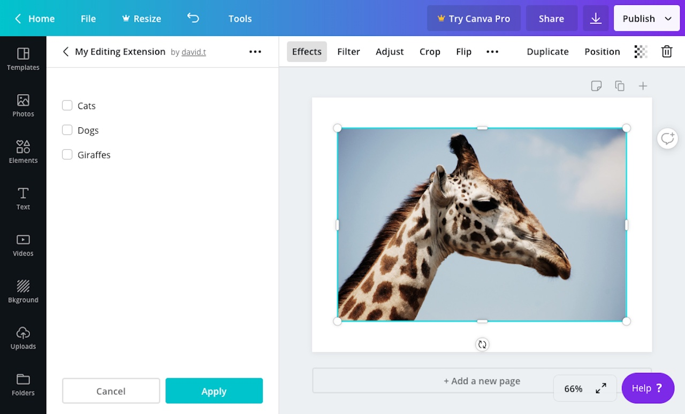

## Usage

```javascript
canva.create("checkbox", {
  id: "checkboxExample",
  label: "Checkbox Example",
  disabled: false,
  checked: false,
});
```

:::note  
 When the value of a control changes, an extension should re-render the control panel. For more information, refer to the [Controls](./#managing-the-state-of-controls.md) topic.  
:::

## Properties

| Property   | Type    | Required | Description                                                             |
| ---------- | ------- | :------: | ----------------------------------------------------------------------- |
| `id`       | string  | <Tick /> | A unique ID for the checkbox.                                           |
| `label`    | string  |          | A human readable label for the checkbox.                                |
| `disabled` | boolean |          | If `true`, the checkbox will be disabled. The default value is `false`. |
| `checked`  | boolean |          | If `true`, the checkbox will be checked. The default value is `false`.  |

## Events

When a user selects a checkbox, the `onControlsEvent` callback is executed:

```javascript
canva.onControlsEvent(async (opts) => {
  console.log(opts.message);
  // {
  //   commit: true,
  //   controlId: "checkboxExample",
  //   controlType: "checkbox",
  //   message: {
  //     type: "change",
  //     checked: true
  //   }
  // }
});
```

This callback receives an object with the following properties:

| Parameter | Type   | Description                  |
| --------- | ------ | ---------------------------- |
| `message` | object | Information about the event. |

The `message` object contains the following properties:

| Property      | Type    | Description                                                                                                                                                                                        |
| ------------- | ------- | -------------------------------------------------------------------------------------------------------------------------------------------------------------------------------------------------- |
| `commit`      | boolean | This value is `false` while the user is interacting with the control and `true` when they have finished interacting with the control. For a checkbox, the value of this property is always `true`. |
| `controlId`   | string  | The ID of the control.                                                                                                                                                                             |
| `controlType` | string  | The type of control. For a checkbox, the value of this property is always `"checkbox"`.                                                                                                            |
| `message`     | object  | Additional information about the event.                                                                                                                                                            |

The inner `message` object contains the following properties:

| Property  | Type    | Description                                                                                    |
| --------- | ------- | ---------------------------------------------------------------------------------------------- |
| `type`    | string  | The type of event. For a checkbox, the value of this property is always `"changed"`.           |
| `checked` | boolean | If `true`, the user has checked the checkbox. If `false`, the user has unchecked the checkbox. |

## Example

```javascript
const canva = window.canva.init();

const state = {
  checkboxExample: false,
};

const renderControls = () => {
  const controls = [
    canva.create("checkbox", {
      id: "checkboxExample",
      label: "Checkbox Example",
      disabled: false,
      checked: state.checkboxExample,
    }),
  ];
  canva.updateControlPanel(controls);
};

canva.onReady(() => {
  renderControls();
});

canva.onControlsEvent(async (opts) => {
  state[opts.message.controlId] = opts.message.checked;

  if (opts.message.commit) {
    renderControls();
  }
});
```
