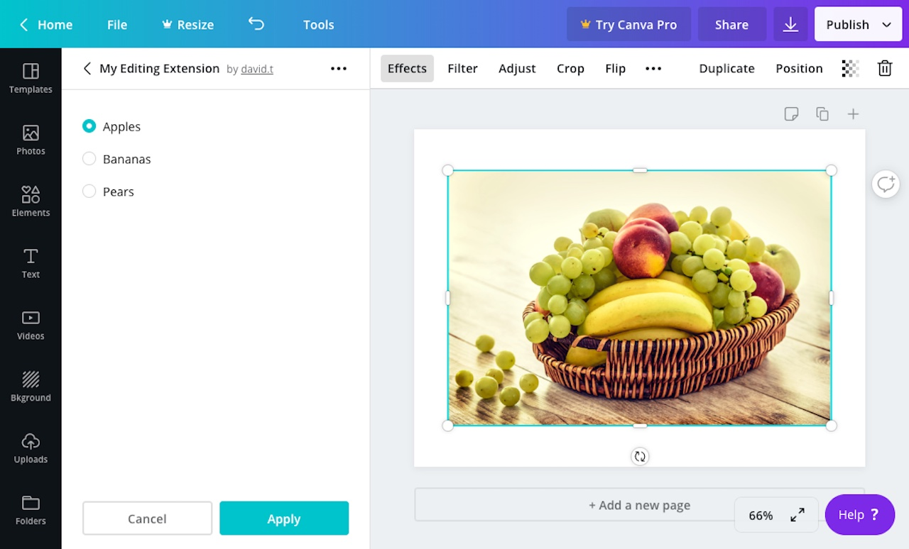

## Usage

```javascript
canva.create("radio_group", {
  id: "radioGroupExample",
  value: "apples",
  buttons: [
    {
      value: "apples",
      label: "Apples",
      disabled: false,
    },
    {
      value: "bananas",
      label: "Bananas",
      disabled: false,
    },
    {
      value: "pears",
      label: "Pears",
      disabled: false,
    },
  ],
});
```

:::note  
 When the value of a control changes, an extension should re-render the control panel. For more information, refer to the [Controls](./#managing-the-state-of-controls.md) topic.  
:::

## Properties

| Property  | Type   | Required | Description                                                                                          |
| --------- | ------ | :------: | ---------------------------------------------------------------------------------------------------- |
| `id`      | string | <Tick /> | A unique ID for the radio group.                                                                     |
| `buttons` | array  | <Tick /> | The radio buttons to render within the radio group.                                                  |
| `value`   | string |          | The value to display as selected. This value must match a `value` property for one of the `buttons`. |

Each object in the `buttons` array should have the following properties:

| Property   | Type    | Required | Description                                                                 |
| ---------- | ------- | :------: | --------------------------------------------------------------------------- |
| `value`    | string  | <Tick /> | The value of the radio button.                                              |
| `label`    | string  | <Tick /> | A human readable label fro the radio button.                                |
| `disabled` | boolean |          | If `true`, the radio button will be disabled. The default value is `false`. |

## Events

When a user selects a radio button, the `onControlsEvent` callback is executed:

```javascript
canva.onControlsEvent(async (opts) => {
  console.log(opts.message);
  // {
  //   commit: true,
  //   controlId: "radioGroupExample",
  //   controlType: "radio_group",
  //   message: {
  //     type: "setValue",
  //     value: "apples"
  //   }
  // }
});
```

This callback receives an object with the following properties:

| Parameter | Type   | Description                  |
| --------- | ------ | ---------------------------- |
| `message` | object | Information about the event. |

The `message` object contains the following properties:

| Property      | Type    | Description                                                                                                                                                                                           |
| ------------- | ------- | ----------------------------------------------------------------------------------------------------------------------------------------------------------------------------------------------------- |
| `commit`      | boolean | This value is `false` while the user is interacting with the control and `true` when they have finished interacting with the control. For a radio group, the value of this property is always `true`. |
| `controlId`   | string  | The ID of the control.                                                                                                                                                                                |
| `controlType` | string  | The type of control. For a radio group, the value of this property is always `"radio_group"`.                                                                                                         |
| `message`     | object  | Additional information about the event.                                                                                                                                                               |

The inner `message` object contains the following properties:

| Property | Type   | Description                                                                              |
| -------- | ------ | ---------------------------------------------------------------------------------------- |
| `type`   | string | The type of event. For a radio group, the value of this property is always `"setValue"`. |
| `value`  | string | The value of the selected radio button.                                                  |

## Example

```javascript
const canva = window.canva.init();

const state = {
  radioGroupExample: "apples",
};

const renderControls = () => {
  const controls = [
    canva.create("radio_group", {
      id: "radioGroupExample",
      value: state.radioGroupExample,
      buttons: [
        {
          value: "apples",
          label: "Apples",
          disabled: false,
        },
        {
          value: "bananas",
          label: "Bananas",
          disabled: false,
        },
        {
          value: "pears",
          label: "Pears",
          disabled: false,
        },
      ],
    }),
  ];
  canva.updateControlPanel(controls);
};

canva.onReady(() => {
  renderControls();
});

canva.onControlsEvent(async (opts) => {
  state[opts.message.controlId] = opts.message.message.value;

  if (opts.message.commit) {
    renderControls();
  }
});
```
