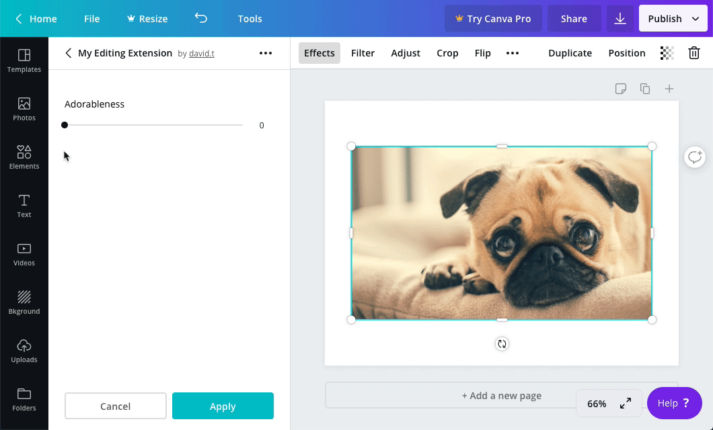

## Usage

```javascript
canva.create("slider", {
  id: "sliderExample",
  label: "Slider Example",
  value: 50,
  min: 0,
  max: 100,
  step: 1,
});
```

:::note  
 When the value of a control changes, an extension should re-render the control panel. For more information, refer to the [Controls](./#managing-the-state-of-controls.md) topic.  
:::

## Properties

| Property | Type   | Required | Description                                                                                                                                    |
| -------- | ------ | :------: | ---------------------------------------------------------------------------------------------------------------------------------------------- |
| `id`     | string | <Tick /> | A unique ID for the slider.                                                                                                                    |
| `label`  | string | <Tick /> | A human readable label for the slider.                                                                                                         |
| `value`  | string | <Tick /> | The number to display as selected in the slider. This number must be within the range of the `min` and `max` properties.                       |
| `min`    | string | <Tick /> | The minimum allowed value of the slider. This number can be an integer or a floating point number. It can also be either negative or positive. |
| `max`    | string | <Tick /> | The maximum allowed value of the slider. This number can be an integer or a floating point number. It can also be either negative or positive. |
| `step`   | string | <Tick /> | The number to increment or decrement by as a user adjusts the value of the slider. This number can be an integer or a floating point number.   |

## Events

When the user changes the value of the slider, the `onControlsEvent` callback is executed:

```javascript
canva.onControlsEvent(async (opts) => {
  console.log(opts.message);
  // {
  //   commit: false,
  //   controlId: "sliderExample",
  //   controlType: "slider",
  //   message: {
  //     type: "setValue",
  //     value: 23
  //   }
  // }
});
```

This callback receives an object with the following properties:

| Parameter | Type   | Description                  |
| --------- | ------ | ---------------------------- |
| `message` | object | Information about the event. |

The `message` object contains the following properties:

| Property      | Type    | Description                                                                                                                           |
| ------------- | ------- | ------------------------------------------------------------------------------------------------------------------------------------- |
| `commit`      | boolean | This value is `false` while the user is interacting with the control and `true` when they have finished interacting with the control. |
| `controlId`   | string  | The ID of the control.                                                                                                                |
| `controlType` | string  | The type of control. For a slider, the value of this property is always `"slider"`.                                                   |
| `message`     | object  | Additional information about the event.                                                                                               |

The inner `message` object contains the following properties:

| Property | Type   | Description                                                                         |
| -------- | ------ | ----------------------------------------------------------------------------------- |
| `type`   | string | The type of event. For a slider, the value of this property is always `"setValue"`. |
| `value`  | string | The value of the slider.                                                            |

## Example

```javascript
const canva = window.canva.init();

const state = {
  sliderExample: 50,
};

const renderControls = () => {
  const controls = [
    canva.create("slider", {
      id: "sliderExample",
      label: "Slider Example",
      value: state.sliderExample,
      min: 0,
      max: 100,
      step: 1,
    }),
  ];
  canva.updateControlPanel(controls);
};

canva.onReady(() => {
  renderControls();
});

canva.onControlsEvent(async (opts) => {
  state[opts.message.controlId] = opts.message.message.value;

  if (opts.message.commit) {
    renderControls();
  }
});
```
