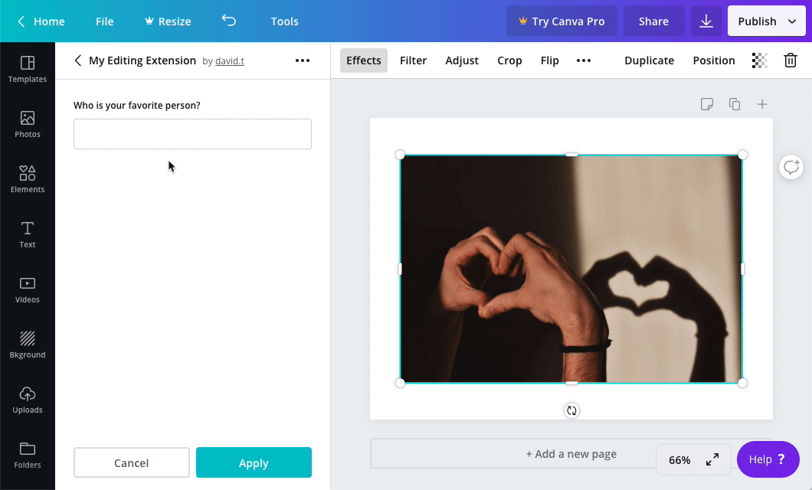

## Usage

```javascript
canva.create("text_input", {
  inputType: "text",
  id: "textInputExample",
  placeholder: "Enter some text...",
  label: "Text Input Example",
  name: "textInputExample",
  disabled: false,
  value: "Hello world",
  maxLength: 50,
});
```

:::note  
 When the value of a control changes, an extension should re-render the control panel. For more information, refer to the [Controls](./#managing-the-state-of-controls.md) topic.  
:::

## Properties

| Property      | Type    | Required | Description                                                                   |
| ------------- | ------- | :------: | ----------------------------------------------------------------------------- |
| `inputType`   | string  | <Tick /> | The type of input. The possible values are `"text"` and `"number"`.           |
| `id`          | string  | <Tick /> | A unique ID for the control.                                                  |
| `placeholder` | string  |          | A human readable prompt that is displayed when the `value` property is empty. |
| `label`       | string  |          | A human readable label.                                                       |
| `name`        | string  |          |                                                                               |
| `disabled`    | boolean |          | If `true`, the text input will be disabled. The default value is `false`.     |
| `value`       | string  |          | The value that will be displayed in the text input.                           |

The following properties are only valid if the `inputType` is `"text"`:

| Property    | Type   | Required | Description                                                 |
| ----------- | ------ | :------: | ----------------------------------------------------------- |
| `maxLength` | number |          | The maximum number of characters allowed in the text input. |

## Events

When a user clicks a button, the `onControlsEvent` callback is executed:

```javascript
canva.onControlsEvent(async (opts) => {
  console.log(opts.message);
  // {
  //   commit: true,
  //   controlId: "textInputExample",
  //   controlType: "text",
  //   message: {
  //     type: "change",
  //     value: "hello world"
  //   }
  // }
});
```

This callback receives an object with the following properties:

| Parameter | Type   | Description                  |
| --------- | ------ | ---------------------------- |
| `message` | object | Information about the event. |

The `message` object contains the following properties:

| Property      | Type    | Description                                                                                                                                                                                          |
| ------------- | ------- | ---------------------------------------------------------------------------------------------------------------------------------------------------------------------------------------------------- |
| `commit`      | boolean | This value is `false` while the user is interacting with the control and `true` when they have finished interacting with the control. For a text input, the value of this property is always `true`. |
| `controlId`   | string  | The ID of the control.                                                                                                                                                                               |
| `controlType` | string  | The type of control. For a text input, the value of this property is always `"text_input"`.                                                                                                          |
| `message`     | object  | Additional information about the event.                                                                                                                                                              |

The inner `message` object contains the following properties:

| Property | Type             | Description                                                                           |
| -------- | ---------------- | ------------------------------------------------------------------------------------- |
| `type`   | string           | The type of event. For a text input, the value of this property is always `"change"`. |
| `value`  | string \| number | The value of the text input.                                                          |

## Example

```javascript
const canva = window.canva.init();

const state = {
  textInputExample: "Hello world",
  numberInputExample: 42,
};

const renderControls = () => {
  const controls = [
    canva.create("text_input", {
      inputType: "text",
      id: "textInputExample",
      placeholder: "Enter some text...",
      label: "Text Input Example",
      disabled: false,
      value: state.textInputExample,
      maxLength: 50,
    }),
    canva.create("text_input", {
      inputType: "number",
      id: "numberInputExample",
      placeholder: "Enter a number...",
      label: "Number Input Example",
      disabled: false,
      value: state.numberInputExample,
      min: 0,
      max: 100,
    }),
  ];
  canva.updateControlPanel(controls);
};

canva.onReady(() => {
  renderControls();
});

canva.onControlsEvent(async (opts) => {
  state[opts.message.controlId] = opts.message.message.value;

  if (opts.message.commit) {
    renderControls();
  }
});
```
