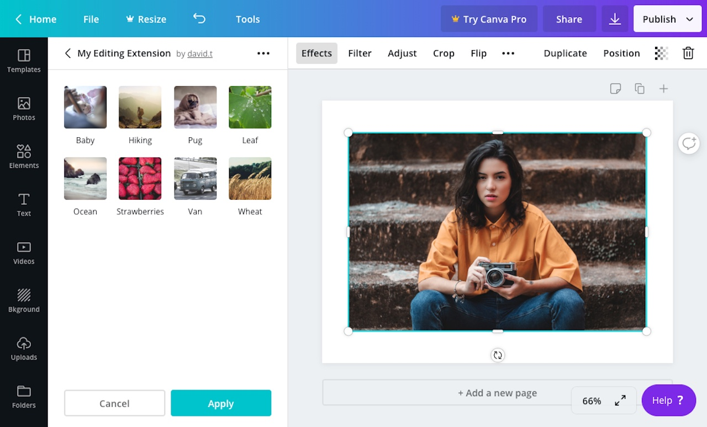

## Usage

```javascript
canva.create("thumbnail_list", {
  id: "thumbnailListExample",
  selectedThumbnailId: "baby",
  items: [
    {
      thumbnailId: "baby",
      label: "Baby",
      defaultSrc: "https://i.picsum.photos/id/1066/2144/1424.jpg",
    },
    {
      thumbnailId: "ocean",
      label: "Ocean",
      defaultSrc: "https://i.picsum.photos/id/179/2048/1365.jpg",
    },
    {
      thumbnailId: "van",
      label: "Van",
      defaultSrc: "https://i.picsum.photos/id/183/2316/1544.jpg",
    },
  ],
});
```

:::note  
 When the value of a control changes, an extension should re-render the control panel. For more information, refer to the [Controls](./#managing-the-state-of-controls.md) topic.  
:::

## Properties

| Property              | Type   | Required | Description                                      |
| --------------------- | ------ | :------: | ------------------------------------------------ |
| `id`                  | string | <Tick /> | A unique ID for the thumbnail list.              |
| `items`               | array  | <Tick /> | The thumbnails to display in the thumbnail list. |
| `selectedThumbnailId` | string |          | The ID of a thumbnail to display as selected.    |

Each object in the `items` array should have the following properties:

| Property      | Type   | Required | Description                                                |
| ------------- | ------ | :------: | ---------------------------------------------------------- |
| `thumbnailId` | string | <Tick /> | A unique ID for the thumbnail.                             |
| `label`       | string | <Tick /> | A human readable label that appears beneath the thumbnail. |
| `defaultSrc`  | array  | <Tick /> | The URL of an image. This can be a Data URI.               |

## Events

When a user clicks a button, the `onControlsEvent` callback is executed:

```javascript
canva.onControlsEvent(async (opts) => {
  console.log(opts.message);
  // {
  //   commit: true,
  //   controlId: "thumbnailListExample",
  //   controlType: "thumbnail_list",
  //   message: {
  //     thumbnailId: "apples",
  //     type: "selected"
  //   }
  // }
});
```

This callback receives an object with the following properties:

| Parameter | Type   | Description                  |
| --------- | ------ | ---------------------------- |
| `message` | object | Information about the event. |

The `message` object contains the following properties:

| Property      | Type    | Description                                                                                                                                                                                              |
| ------------- | ------- | -------------------------------------------------------------------------------------------------------------------------------------------------------------------------------------------------------- |
| `commit`      | boolean | This value is `false` while the user is interacting with the control and `true` when they have finished interacting with the control. For a thumbnail list, the value of this property is always `true`. |
| `controlId`   | string  | The ID of the control.                                                                                                                                                                                   |
| `controlType` | string  | The type of control. For a thumbnail list, the value of this property is always `"thumbnail_list"`.                                                                                                      |
| `message`     | object  | Additional information about the event.                                                                                                                                                                  |

The inner `message` object contains the following properties:

| Property      | Type   | Description                                                                                 |
| ------------- | ------ | ------------------------------------------------------------------------------------------- |
| `type`        | string | The type of event. For a thumbnail list, the value of this property is always `"selected"`. |
| `thumbnailId` | string | The ID of the selected thumbnail.                                                           |

## Example

```javascript
const canva = window.canva.init();

const state = {
  thumbnailListExample: "van",
};

const renderControls = () => {
  const controls = [
    canva.create("thumbnail_list", {
      id: "thumbnailListExample",
      selectedThumbnailId: state.thumbnailListExample,
      items: [
        {
          thumbnailId: "baby",
          label: "Baby",
          defaultSrc: "https://i.picsum.photos/id/1066/2144/1424.jpg",
        },
        {
          thumbnailId: "ocean",
          label: "Ocean",
          defaultSrc: "https://i.picsum.photos/id/179/2048/1365.jpg",
        },
        {
          thumbnailId: "van",
          label: "Van",
          defaultSrc: "https://i.picsum.photos/id/183/2316/1544.jpg",
        },
      ],
    }),
  ];
  canva.updateControlPanel(controls);
};

canva.onReady(() => {
  renderControls();
});

canva.onControlsEvent(async (opts) => {
  state[opts.message.controlId] = opts.message.message.thumbnailId;

  if (opts.message.commit) {
    renderControls();
  }
});
```
