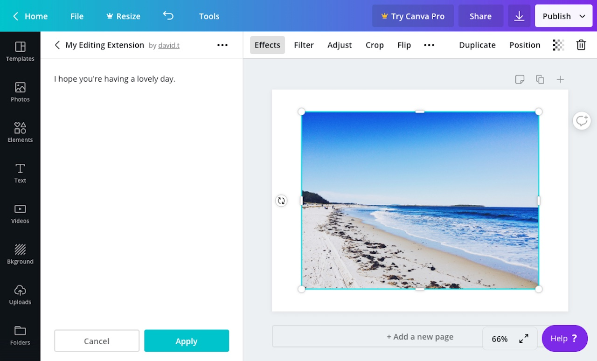

For an editing extension to be accepted into the [Apps Directory](https://canva.com/apps), all of the strings for its controls must be stored in a JSON file and uploaded to the Developer Portal via the **Localized Labels JSON file** field.

This allows the Canva team to:

- review the strings as part of the submission process
- translate strings into other languages

This topic describes how this JSON file should be structured and how to access the strings from within the extension.

## Structure of a localized labels file

This is the structure of the JSON file that needs to be uploaded to the Developer Portal:

```json
{
  "en": [
    {
      "key": "greeting",
      "value": "I hope you're having a lovely day.",
      "translatorNote": "Label for notification when user opens the app."
    }
  ]
}
```

Here, we can see that there's a top-level property named `"en"`. This is the language code for English. At the moment, all developers must provide us with the English versions of their labels.

The `"en"` property contains an array of objects, with each object representing a string:

```json
{
  "key": "greeting",
  "value": "I hope you're having a lovely day.",
  "translatorNote": "A friendly message for when the user opens the app."
}
```

Each object must have the following properties:

| Property         | Type   | Description                                                         |
| ---------------- | ------ | ------------------------------------------------------------------- |
| `key`            | string | A unique ID for the string                                          |
| `value`          | string | The content of the string.                                          |
| `translatorNote` | string | A note that provides context to assist with translating the string. |

## Adding localized labels to an editing extension

To add localized labels to an editing extension:

1.  Navigate to an app via the Developer Portal.
2.  From the **Extensions** page, expand the **Editing** panel.
3.  Upload the JSON file to the **Localized Labels JSON file** field.

The labels will be passed into the app via the `onReady` callback:

```javascript
const canva = window.canva.init();

canva.onReady(async (opts) => {
  console.log(opts.localizedLabels);
  // {
  //   greeting: "I hope you're having a lovely day."
  // }
});
```

You can then access individual strings by referring to their `key` properties:

```javascript
canva.onReady(async (opts) => {
  console.log(opts.localizedLabels.greeting);
  // I hope you're having a lovely day.
});
```

This is an example of an extension that renders a [Paragraph](./controls/paragraph.md) control with a localizable string:

```javascript
const { imageHelpers } = window.canva;
const canva = window.canva.init();

canva.onReady(async (opts) => {
  const img = await imageHelpers.toImageElement(opts.image);

  img.width = opts.previewSize.width;
  img.height = opts.previewSize.height;
  img.style.width = "100%";
  img.style.height = "100%";

  document.body.appendChild(img);

  const controls = [
    canva.create("paragraph", {
      id: "myExampleParagraph",
      text: opts.localizedLabels.greeting,
    }),
  ];

  canva.updateControlPanel(controls);
});
```



## JSON Schema

Your JSON file will be validated when you upload it to the Developer Portal. If you'd like to validate the file before uploading it, you can use this JSON Schema:

```json
{
  "properties": {
    "en": {
      "type": "array",
      "items": {
        "properties": {
          "key": {
            "type": "string",
            "description": "A unique ID for the string."
          },
          "value": {
            "type": "string",
            "description": "The content of the string."
          },
          "translatorNote": {
            "type": "string",
            "description": "A note that provides context to assist with translating the string."
          }
        },
        "required": ["key", "value", "translatorNote"],
        "additionalProperties": false
      }
    }
  },
  "additionalProperties": false
}
```
