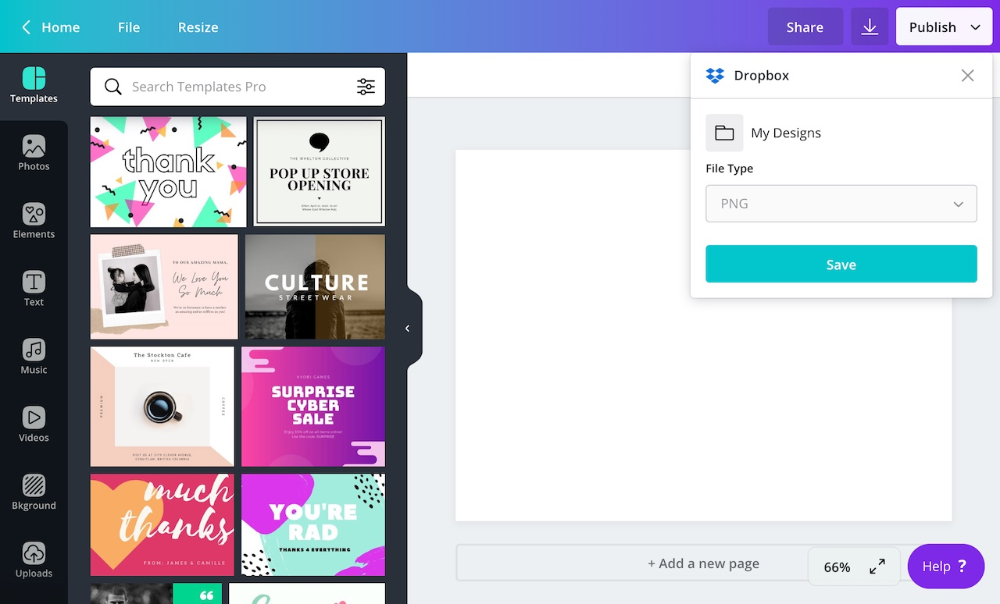
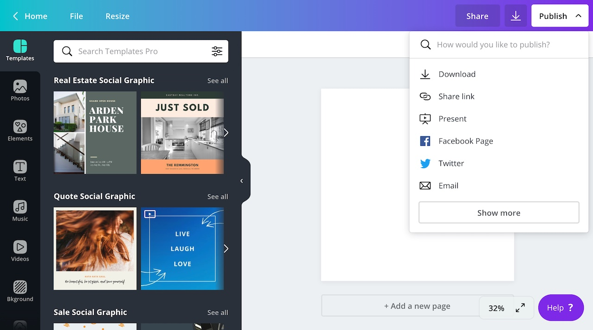
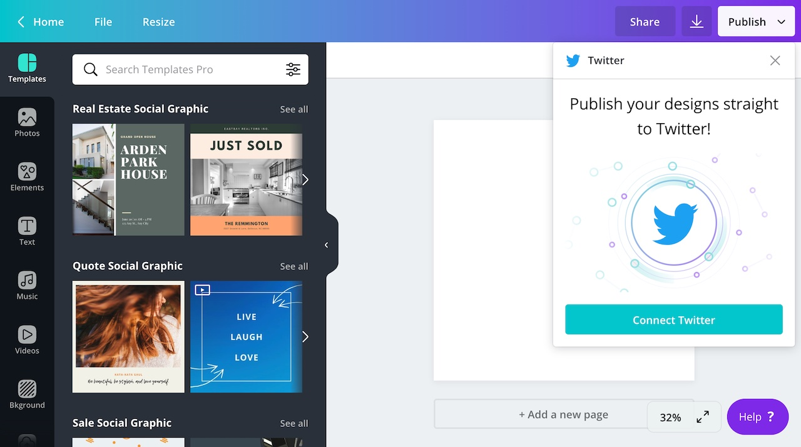
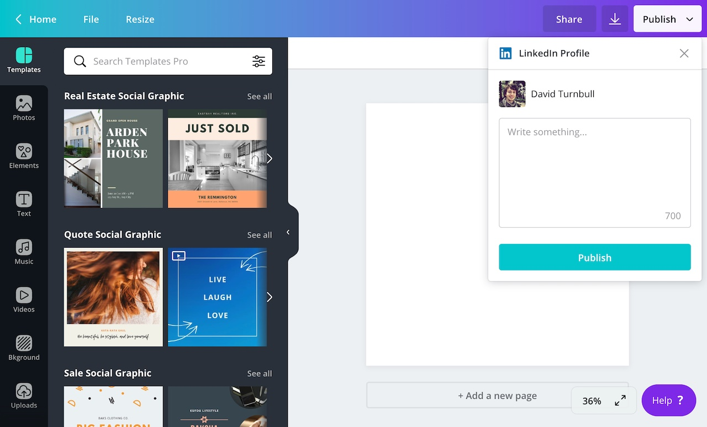

There are three types of _extensions_ a developer can add to a Canva app:

- [content](./content-extensions.md)
- [editing](./editing-extensions.md)
- [publish]()

The purpose of a _publish extension_ is to allow Canva's users to publish their designs to third-party destinations, such as a social media platform or a file storage service.

For example, the Dropbox app allows users to publish their designs to their Dropbox account:



Some other examples of publish extensions include:

- HubSpot
- Mailchimp
- Twitter

You can find more examples at [canva.com/apps](https://www.canva.com/apps/).

## What can users publish?

A publish extension can publish the user's designs in one or more of the following formats:

- JPG
- PNG
- PDF
- PPTX

You can configure the types of files an extension supports via the Developer Portal.

## How users experience publish extensions

In the Canva editor, users can click the **Publish** button to view a list of publishing destinations.



When a user selects a destination, they're typically asked to authenticate with that destination. The authentication occurs in a pop-up window and the exact flow is determined by the developer. You can learn more about this in the [Authentication](./publish-extensions/authentication.md) topic.



After the user authenticates -- or if authentication is not required -- the user experience depends on the [layout](./publish-extensions/default-layout.md) the extension is configured to use.

The available layouts include:

- [Default](./publish-extensions/default-layout.md)
- [List](./publish-extensions/list-layout.md)
- [Nested](./publish-extensions/nested-layout.md)

This, for instance, is an example of the **Default** layout:



You can refer to the linked topics for examples of each layout.

:::note  
 All extensions must be connected (installed) before they can be used. This is a one-time-only process that gives users a chance to agree to the extension's terms and conditions.  
:::

## How publish extensions work

At its most basic, a publish extension is a REST API.

It doesn't matter what language or framework is used to create this API. All that matters is that Canva sends requests to certain routes and expects to receive responses in a format that it understands.

The routes an extension is required to support depends on its layout:

| Method | Path                        | Default Layout | List Layout | Nested Layout |
| ------ | --------------------------- | :------------: | :---------: | :-----------: |
| `POST` | `/publish/resources/upload` |    <Tick />    |  <Tick />   |   <Tick />    |
| `POST` | `/publish/resources/find`   |                |  <Tick />   |   <Tick />    |
| `POST` | `/publish/resources/get`    |                |  <Tick />   |   <Tick />    |

At a minimum, all publish extensions must support the `POST /publish/resources/upload` route. This route is responsible for uploading the user's design to the destination platform.

## Example

This is an example of a publish extension that publishes the user's design to [Cloudinary](https://cloudinary.com), a digital asset management platform:

```javascript
const cloudinary = require("cloudinary");
const express = require("express");
const app = express();

app.use(express.json());

app.post("/publish/resources/upload", async (request, response) => {
  for (let asset of request.body.assets) {
    cloudinary.v2.uploader.upload(asset.url);
  }

  response.send({
    type: "SUCCESS",
  });
});

app.listen(process.env.PORT || 3000);
```

To learn how to create this extension from scratch, check out [the quick start guide](./publish-extensions/quick-start.md).
