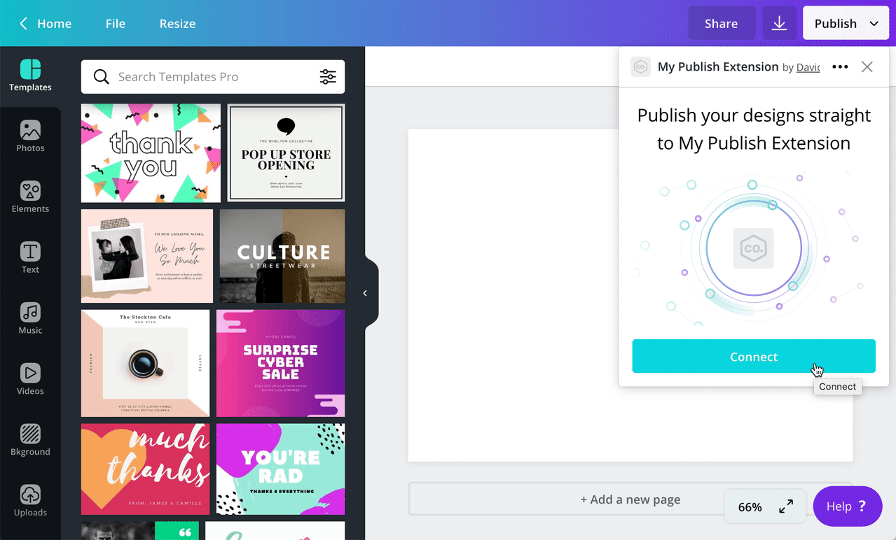
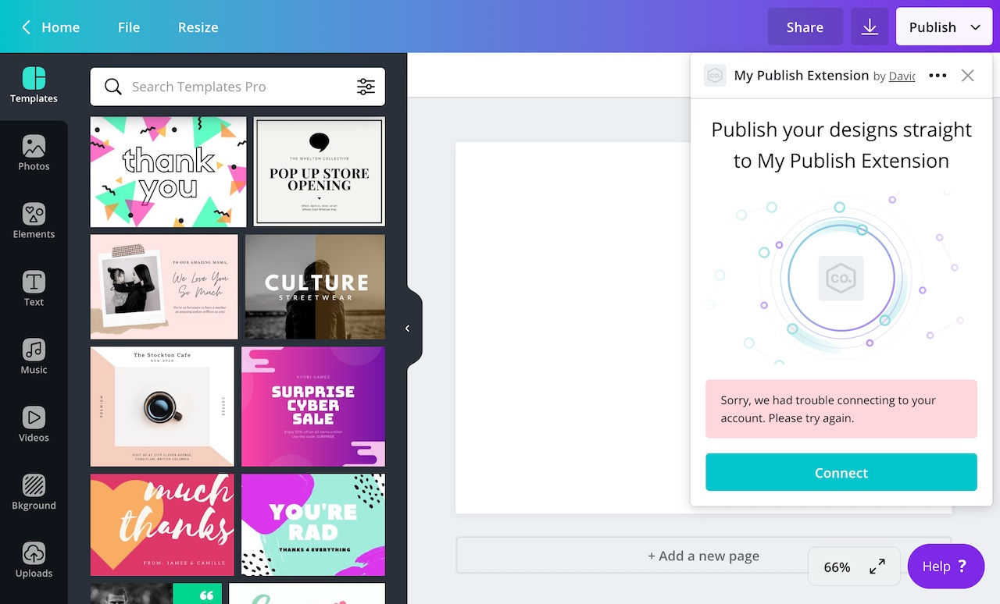

A publish extension can be configured to support authentication. This allows Canva's users to publish designs to destinations that aren't publicly accessible, such as their social media account or a file storage service.

:::note  
 You can also add authentication to a [content extension](./../content-extensions.md), but the implementation is slightly different. For more information, refer to [Authentication for content extensions](./../content-extensions/authentication.md).  
:::

## Enabling authentication

By default, apps don't support authentication. You need to enable the feature.

To enable authentication:

1.  Navigate to an app via the Developer Portal.
2.  Select **Verification & auth**.
3.  Toggle **This app requires authentication** to the _on_ position.

When authentication is enabled, the following fields are required:

- Redirect URL
- Authentication status endpoint URL

The usage of these fields is explained throughout this topic.

## How authentication works

To understand authentication, let's take a step-by-step walkthrough through an entire authentication flow, from beginning to end.

### Step 1: Canva sends a `POST` request to the app's "Authentication status endpoint URL"

When a user opens an authentication-enabled app, Canva sends a `POST` request to the following endpoint:

```bash
<authentication_status_endpoint_url>/configuration
```

The `<authentication_status_endpoint_url>` placeholder refers to the value of the **Authentication status endpoint URL** field, which can be set on the app's **Verification & auth** page.

Canva automatically appends a value of `/configuration` to this endpoint, so `/configuration` should be omitted from the **Authentication status endpoint URL** field.

:::note  
 You can set the to the same value as an extension's , but the fields are distinct to allow developers to choose.  
:::

### Step 2: The app checks if the user is already authenticated

After receiving the `POST` request from Canva, the app should check if the user is already authenticated.

_How_ exactly the app checks if the user is authenticated depends on the app. Typically though, when a user authenticates, an app will save the user's ID and some kind of authentication token to a database. Then the app can query the database and check if the user has a valid authentication token.

To allow for this, Canva provides a `user` property in the body of the request:

```json
{
  "user": "AUQ2RUzug9pEvgpK9lL2qlpRsIbn1Vy5GoEt1MaKRE=",
  "brand": "AUQ2RUxiRj966Wsvp7oGrz33BnaFmtq4ftBeLCSHf8="
}
```

The `user` property contains the ID of the user.

When the user is authenticated, the app should respond with a `"SUCCESS"` response:

```json
{
  "type": "SUCCESS",
  "labels": ["PUBLISH"]
}
```

This tells Canva to skip the authentication flow and continue loading the app.

But let's assume the user isn't authenticated.

### Step 3: If the user is not authenticated, the app returns a `"CONFIGURATION_REQUIRED"` error

If the user isn't authenticated, the app should respond with a `"CONFIGURATION_REQUIRED"` error:

```json
{
  "type": "ERROR",
  "errorCode": "CONFIGURATION_REQUIRED"
}
```

This tells Canva to render a **Connect** button.


:::note  
 The `errorCode` is `"CONFIGURATION_REQUIRED"` and not `"AUTHENTICATION_REQUIRED"` because, in the future, other forms of user-specific configuration may be supported.  
:::

### Step 5: The user clicks the "Connect" button

When the user clicks the **Connect** button, a pop-up window appears.



Inside this pop-up window, Canva redirects the user to the app's **Redirect URL**. You can set this URL from the app's **Verification & auth** page.

The **Redirect URL** should point to a page that allows the user to authenticate. Because the app is in complete control of this page, any authentication method is supported, including:

- login form with a username and password field
- OAuth 2.0 authorization flow
- QR code the user scans with their phone

During this redirection, Canva appends the following query parameters to the URL:

| Name         | Type   | Required | Description |
| ------------ | ------ | -------- | ----------- |
| `helloWorld` | string | <Tick /> |             |

These parameters serve multiple purposes:

The app can use the `user` parameter to persist the ID of the user (if they successfully authenticate). This allows the app to determine if the user is authenticated when they return to the app.

The app needs to (temporarily) keep track of the `state` parameter. Canva provides this parameter at the start of the authentication flow and the app must return the parameter to Canva at the end of the flow. This is a security measure to defend against [Cross-site request forgery](https://en.wikipedia.org/wiki/Cross-site_request_forgery) (CSRF) attacks.

All of these parameters are required to verify that the request Canva sends to the **Redirect URL** is _actually_ coming from Canva. This is a security measure that the app must implement to be accepted into the Apps Directory. For more information, refer to [Verifying `GET` requests](./../verifying-requests/#verifying-get-requests.md).

### Step 8: The user navigates through the app's authentication flow

This part of the process is a black box. Canva doesn't care how an app handles authentication. As explained above though, the app does need to keep track of the `user` and `state` parameter.

### Step 9: The app stores whatever data it requires to identify the user in the future

If the user successfully authenticates, the app should use the `user` parameter to persist the ID of the user to a database. Then, when the user returns to Canva in the future, the app can query the database to check that the user is authenticated. A (very) minimal implementation of this could be an SQL table of user IDs.

### Step 10: The app redirects the user back to Canva

If the user successfully authenticates, the app should redirect the user back to the following URL from within the pop-up window:

```bash
https://canva.com/apps/configured?success=true&state=
```

This URL has two query parameters:

| Parameter | Type    | Description                                                                             |
| --------- | ------- | --------------------------------------------------------------------------------------- |
| `success` | boolean | A value of `true` indicates the user has successfully authenticated.                    |
| `state`   | string  | A unique signature that's used to validate the authenticity of authentication requests. |

If the authentication is successful, `success` should be set to `true`.

The value of the `state` parameter should be set to the same value of the `state` parameter that Canva provided when it originally redirected the user to the **Redirect URL**.

When the app redirects the user to this URL, the pop-up window will close and Canva will send another `POST` request to the **Authentication status endpoint URL**. This time though, the app should be able to determine that the user is authenticated and, if they are, respond with a `"SUCCESS"` response:

```json
{
  "type": "SUCCESS",
  "labels": ["PUBLISH"]
}
```

This will continue the loading of the app.

:::note  
 The value of the `labels` property is determined by the `extensions` parameter that's appended to the .  
:::

If the user fails to authenticate, the app should redirect the user back to the following URL from within the pop-up window:

```bash
https://canva.com/apps/configured?success=false&state=
```

Here, the only difference is that the value of the `success` parameter is `false` instead of `true`.

When the app redirects the user to this URL, the pop-up window will close and Canva will display an error from within the **Publish** menu. No additional requests will be sent to the app.


