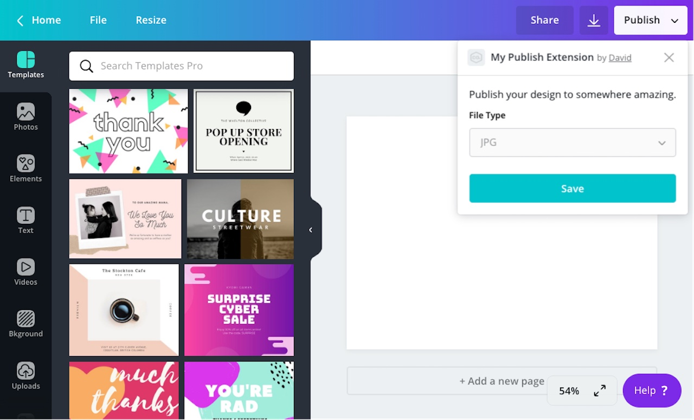

You can configure a [publish extension](./../publish-extensions.md) to use one of three _layouts_:

- Default layout
- [List layout](./list-layout.md)
- [Nested layout](./nested-layout.md)

The selected layout has a significant impact on the user experience of the extension.

When a user opens a publish extension that uses the **Default** layout, they'll be shown a handful of options and a **Save** button.



The available options depend on:

- how the extension is configured via the Developer Portal
- the user's design (some options, for instance, only appear if the design has multiple pages)

When the user clicks the **Save** button, their design will be published to the destination platform.

## Uploading the user's design

When a user clicks the **Save** button, Canva sends a `POST` request to the following endpoint:

```bash
<endpoint_url>/publish/resources/upload
```

The purpose of this endpoint is to upload the user's design to the destination platform.

The body of this request contains an array of _assets_:

```json
{
  "user": "AUQ2RUzug9pEvgpK9lL2qlpRsIbn1Vy5GoEt1MaKRE=",
  "brand": "AUQ2RUxiRj966Wsvp7oGrz33BnaFmtq4ftBeLCSHf8=",
  "label": "PUBLISH",
  "assets": [
    {
      "url": "https://s3.amazonaws.com/.../49-04fa92cbfbf8.jpg",
      "type": "JPG",
      "name": "0001-144954.jpg"
    }
  ]
}
```

If the user publishes their design as a JPG or PNG, each page of the design is provided as an asset. If the user publishes their design as a PDF or PPTX, the entire design is provided as a single asset.

Your extension should download the assets and upload them to the destination platform.

If the assets are uploaded successfully, the endpoint should respond with a `"SUCCESS"` response:

```json
{
  "type": "SUCCESS"
}
```

If the assets are not uploaded successfully, the endpoint should respond with an `"ERROR"` response:

```json
{
  "type": "ERROR",
  "errorCode": "INVALID_REQUEST"
}
```

For a complete list of supported error codes, refer to [Error handling](./error-handling.md).
