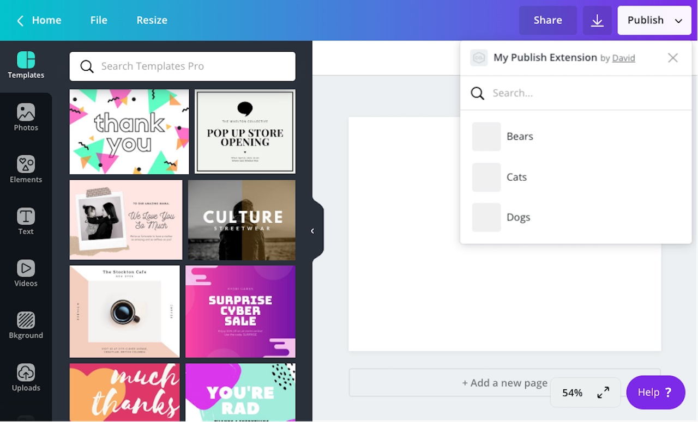

You can configure a [publish extension](./../publish-extensions.md) to use one of three _layouts_:

- [Default layout](./default-layout.md)
- List layout
- [Nested layout](./nested-layout.md)

The selected layout has a significant impact on the user experience of the extension.

When a user opens a publish extension that uses the **List** layout, they'll be shown a list of _containers_.



You can think of a container as being the same as a folder, but the term "container" is used because it's more broadly applicable. (All folders are containers, but not all containers are folders.)

If an extension uses the **List** layout:

- users must select a container before publishing their design
- containers cannot be nested within one another (it's a flat list)

:::note  
 The layout is very similar to the layout. If you're only interested in the differences between these layouts, refer to [List vs. Nested layout](./list-vs-nested-layout.md).  
:::

## Rendering a list of containers

When a user opens a publish extension that uses the **List** layout, Canva sends a `POST` request to the following endpoint:

```bash
<endpoint_url>/publish/resources/find
```

The purpose of this endpoint is to retrieve the list of containers that will be shown to the user.

The body of this request contains the following properties:

```json
{
  "user": "AUwp7hBFlaa84jGiP17Fo0y5_oe9ZhijI5w3RchtKTg=",
  "brand": "AUwp7hDABwdaAwyEBekKbybZGICj4Ue03fXxKpJ55uU=",
  "label": "PUBLISH",
  "limit": 100,
  "preferredThumbnailWidth": 50,
  "preferredThumbnailHeight": 50
}
```

In response to this request, the endpoint should respond with an array of containers:

```json
{
  "type": "SUCCESS",
  "resources": [
    {
      "id": "12345",
      "name": "An Example Container",
      "type": "CONTAINER",
      "thumbnail": {
        "url": "https://picsum.photos/200"
      },
      "isOwner": true,
      "readOnly": false
    }
  ]
}
```

Each container should have the following properties:

```json
{
  "id": "12345",
  "name": "An Example Container",
  "type": "CONTAINER",
  "thumbnail": {
    "url": "https://picsum.photos/200"
  },
  "isOwner": true,
  "readOnly": false
}
```

These containers are rendered as folders in the **Publish** menu.

This response can also include `"IMAGE"` resources:

```json
{
  "id": "12345",
  "name": "An Example Image",
  "type": "IMAGE",
  "thumbnail": {
    "url": "https://picsum.photos/200"
  },
  "isOwner": true,
  "readOnly": false
}
```

These resources are rendered as files the user cannot interact with.

:::note  
 Unlike content extensions, different types of resources can be provided in a single response.  
:::

## Choosing a container

When a user selects a container and clicks the **Choose** button, they'll be shown a handful of options and a **Save** button.

The available options depend on:

- how the extension is configured via the Developer Portal
- the user's design (some options, for instance, only appear if the design has multiple pages)

## Verifying that a container (still) exists

When a user clicks the **Save** button, Canva sends a `POST` request to the following endpoint:

```bash
<endpoint_url>/publish/resources/get
```

The purpose of this endpoint is to verify that the container still exists on the destination platform.

The body of the request contains the following properties:

```json
{
  "user": "AUQ2RUzug9pEvgpK9lL2qlpRsIbn1Vy5GoEt1MaKRE=",
  "brand": "AUQ2RUxiRj966Wsvp7oGrz33BnaFmtq4ftBeLCSHf8=",
  "label": "PUBLISH",
  "id": "12345",
  "preferredThumbnailWidth": 50,
  "preferredThumbnailHeight": 50
}
```

The `id` property can be used to verify the existence of the container.

If the container still exists, the endpoint should respond with a `"SUCCESS"` response:

```json
{
  "type": "SUCCESS",
  "resource": {
    "type": "CONTAINER",
    "id": "12345",
    "name": "An Example Container",
    "readOnly": false,
    "isOwner": true
  }
}
```

If the container no longer exists, or if some other exception occurs, the endpoint should respond with an `"ERROR"` response:

```json
{
  "type": "ERROR",
  "errorCode": "INVALID_REQUEST"
}
```

For a complete list of supported error codes, refer to [Error handling](./error-handling.md).

## Uploading the user's design

After the existence of the container has been verified, Canva sends a `POST` request to the following endpoint:

```bash
<endpoint_url>/publish/resources/upload
```

The purpose of this endpoint is to upload the user's design to the destination platform.

The body of this request contains an array of _assets_:

```json
{
  "user": "AUQ2RUzug9pEvgpK9lL2qlpRsIbn1Vy5GoEt1MaKRE=",
  "brand": "AUQ2RUxiRj966Wsvp7oGrz33BnaFmtq4ftBeLCSHf8=",
  "label": "PUBLISH",
  "assets": [
    {
      "url": "https://s3.amazonaws.com/.../49-04fa92cbfbf8.jpg",
      "type": "JPG",
      "name": "0001-144954.jpg"
    }
  ],
  "parent": "12345"
}
```

If the user publishes their design as a JPG or PNG, each page of the design is provided as an asset. If the user publishes their design as a PDF or PPTX, the entire design is provided as a single asset.

Your extension should download the assets and upload them to the destination platform.

The `id` of the selected container is available via the `parent` property. You can use this property to upload the assets to the correct location.

If the assets are uploaded successfully, the endpoint should respond with a `"SUCCESS"` response:

```json
{
  "type": "SUCCESS"
}
```

If the assets are not uploaded successfully, the endpoint should respond with an `"ERROR"` response:

```json
{
  "type": "ERROR",
  "errorCode": "INVALID_REQUEST"
}
```

For a complete list of supported error codes, refer to [Error handling](./error-handling.md).
