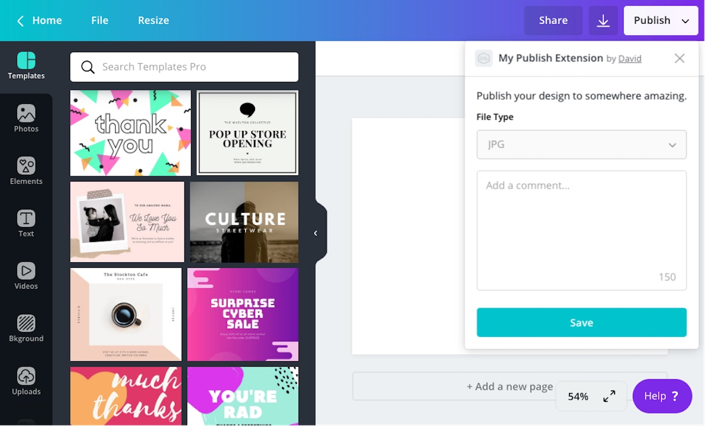

When a user publishes their design, you can prompt them to provide a message.

What you do with this message is up to you. If users a publishing their design to a social media platform, for instance, you might publish this message alongside the media. But if a user is publishing their design to a file storage service, you might use the message as a file name.

## Enabling messages

By default, users aren't prompted to provide a message. You must enable the feature.

To enable the message field:

1.  Navigate to an app via the Developer Portal.
2.  From the **Extensions** page, expand the **Publish** panel.
3.  Select the **Message required** checkbox.

:::note  
 If the message field is enabled, it must be required. It can't be enabled and optional.  
:::

## Receiving messages

When a user publishes their design, Canva sends a `POST` request to `/publish/resources/upload`. If the message field is enabled, the user's message will be included in the body of this request:

```json
{
  "user": "AUQ2RUzug9pEvgpK9lL2qlpRsIbn1Vy5GoEt1MaKRE=",
  "brand": "AUQ2RUxiRj966Wsvp7oGrz33BnaFmtq4ftBeLCSHf8=",
  "label": "PUBLISH",
  "assets": [
    {
      "url": "https://s3.amazonaws.com/.../49-04fa92cbfbf8.jpg",
      "type": "JPG",
      "name": "0001-144954.jpg"
    }
  ],
  "message": "This is an example message. Have a lovely day!"
}
```
