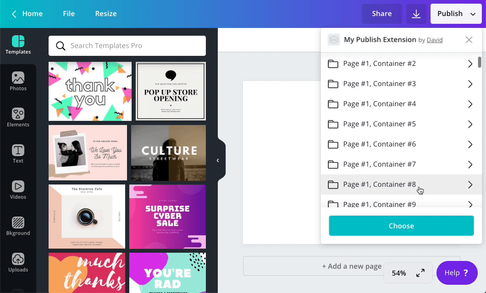

:::note  
 For a publish extension to support pagination, it must use the [List](./list-layout.md) or [Nested](./nested-layout.md) layout.  
:::

In a publish extension, there's a limit to how many resources -- images or containers -- can be returned in a single response. This limit ensures that resources are loaded quickly.

To provide users with more resources than this limit allows, they need to be loaded across multiple requests. In some APIs, this is known as _pagination_. In the publish extension API, it's known as _continuation_. The terms, however, can be used interchangeably.

The best way to understand pagination is with a practical example, so this topic explains how to allow users to paginate through an arbitrary list of resources.



## Prerequisites

This tutorial assumes experience with:

- REST APIs
- Node.js
- Express.js

You should have also completed the [quick start for publish extensions](./quick-start.md).

## Setup

Before continuing:

1.  Create an app via the Developer Portal.
2.  Add a content extension to the app.
3.  Setup a REST API with [Glitch](https://glitch.com) and Express.js:

    ```javascript
    const express = require("express");
    const app = express();

    app.use(express.json());

    // Routes go here

    app.listen(process.env.PORT || 3000);
    ```

## Loading the initial page of resources

When a user opens a publish extension, Canva sends a `POST` request to `/publish/resources/find`:

```javascript
app.post("/publish/resources/find", async (request, response) => {
  console.log(request.body);
});
```

The purpose of this request is to retrieve that resources that will appear in the **Publish** menu.

For this tutorial, use the `fill` and `map` methods to generate an array of `"CONTAINER"` resources:

```javascript
app.post("/publish/resources/find", async (request, response) => {
  const containers = new Array(20).fill(0).map((item, index) => {
    return {
      type: "CONTAINER",
      id: `${index}`,
      name: `Container #${index}`,
      isOwner: true,
      readOnly: false,
    };
  });

  response.send({
    type: "SUCCESS",
    resources: containers,
  });
});
```

:::warning  
 You cannot return more than 100 resources in a single response.  
:::

## Providing the next page number in the response

Before a user reaches the end of the resource list, we want to trigger an additional request to `/publish/resources/find`. This will allow us to seamlessly load additional resources, creating the effect of infinite scrolling.

To accomplish this, add a `continuation` property to the response:

```javascript
response.send({
  type: "SUCCESS",
  resources: images,
  continuation: "2",
});
```

The presence of this property tells Canva that it should send another `POST` request to `/publish/resources/find` before the user reaches the end of the resource list. The value of this property will also be included in the body of that request.

In this example, the value of the `continuation` property is `"2"`. This is because we've loaded the first page of results and we would like to load the second page. But this value does not _have_ to be a page number. The only requirement is that this value is a string.

After making this change, scroll through the resources in the side panel.

The same resources will be repeatedly loaded. This isn't exactly what we want, but it's a step in the right direction.

## Getting the current page number from the request body

When a `continuation` property is included in a response, that same `continuation` property will be made available in the body of the next `POST` request that's sent to `/publish/resources/find`.

To see an example of this, log the value of `request.body.continuation`:

```javascript
console.log(request.body.continuation);
```

When the first page of resources is loaded, the `continuation` property is `null`. This is because there isn't a previous response. But if you trigger another request by scrolling through the resources, the value of `"2"` will be logged. You can use this behavior to load unique resources for each request.

At the top of the route, before the `options` object, create a `currentPage` variable that contains the value of the request body's `continuation` property:

```javascript
const currentPage = request.body.continuation;
```

But since the `continuation` property will be `null` on the initial request, provide a fall-back value of `"1"`:

```javascript
const currentPage = request.body.continuation || "1";
```

This code will include the page number in the name of the resources:

```javascript
const resources = new Array(20).fill(0).map((item, index) => {
  return {
    type: "CONTAINER",
    id: `${currentPage}-${index}`,
    name: `Page #${currentPage}, Container #${index}`,
    isOwner: true,
    readOnly: false,
  };
});
```

Based on these changes, we'll be able to load the first and second pages into the side panel.

If we keep scrolling through the resources though, it's now the second page of images that will be repeatedly loaded. This is because we've hard-coded the value of the `continuation` property in all responses as `"2"`.

Even so, this is another step in the right direction.

## Incrementing the page number

To load unique resources for every request, we need to increment the value of the `continuation` property.

Before the `response.send` method, create a variable that parses the number from the `currentPage` variable, increments it by one, and converts the result back into a string:

```javascript
const nextPage = (parseInt(currentPage, 10) + 1).toString();
```

Then provide this variable in the response:

```javascript
response.send({
  type: "SUCCESS",
  resources: images,
  continuation: nextPage,
});
```

Based on this change, a unique set of resources will be loaded for each request.

## Loading the final page of resources

When the final page of resources is reached, don't provide a `continuation` property in the response:

```javascript
response.send({
  type: "SUCCESS",
  resources: images,
});
```

...or set the `continuation` property to `null`:

```javascript
response.send({
  type: "SUCCESS",
  resources: images,
  continuation: null,
});
```

This signifies that there's no more pages to load.

## Example

```javascript
const express = require("express");
const app = express();

app.use(express.json());

app.post("/publish/resources/find", async (request, response) => {
  const currentPage = request.body.continuation || "1";
  const nextPage = (parseInt(currentPage, 10) + 1).toString();
  const maxPages = 5;

  const resources = new Array(20).fill(0).map((item, index) => {
    return {
      type: "CONTAINER",
      id: `${currentPage}-${index}`,
      name: `Page #${currentPage}, Container #${index}`,
      isOwner: true,
      readOnly: false,
    };
  });

  response.send({
    type: "SUCCESS",
    resources,
    continuation: currentPage < maxPages ? nextPage : null,
  });
});

app.listen(process.env.PORT || 3000);
```
