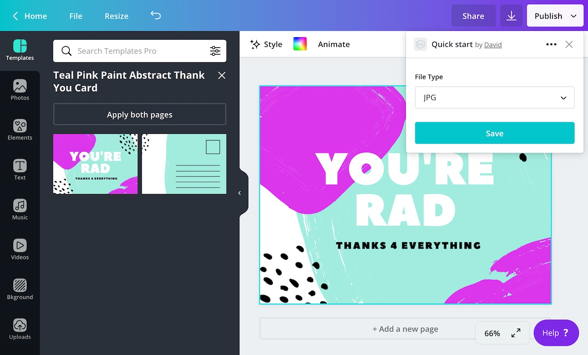
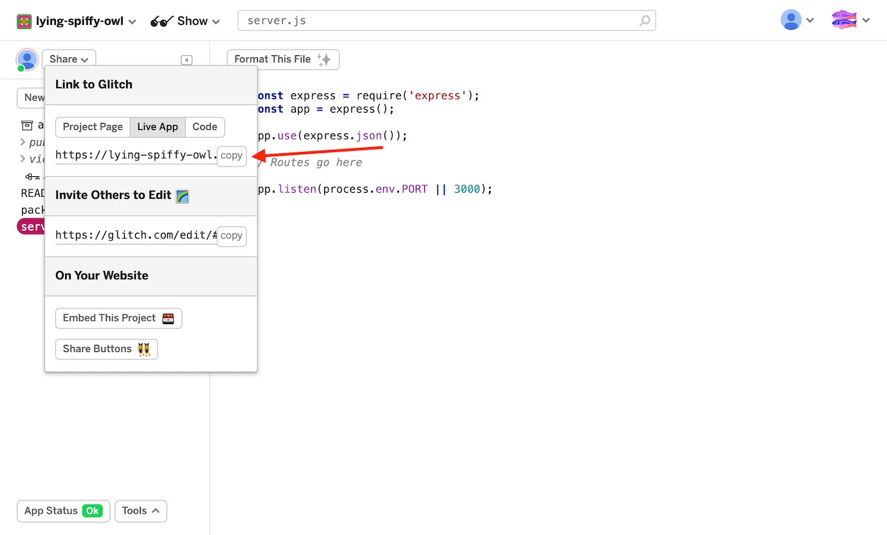
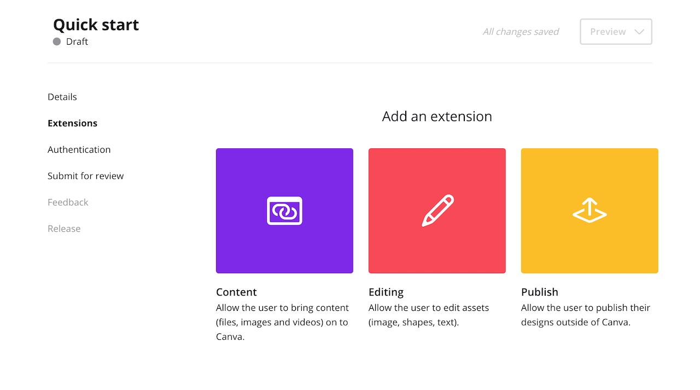
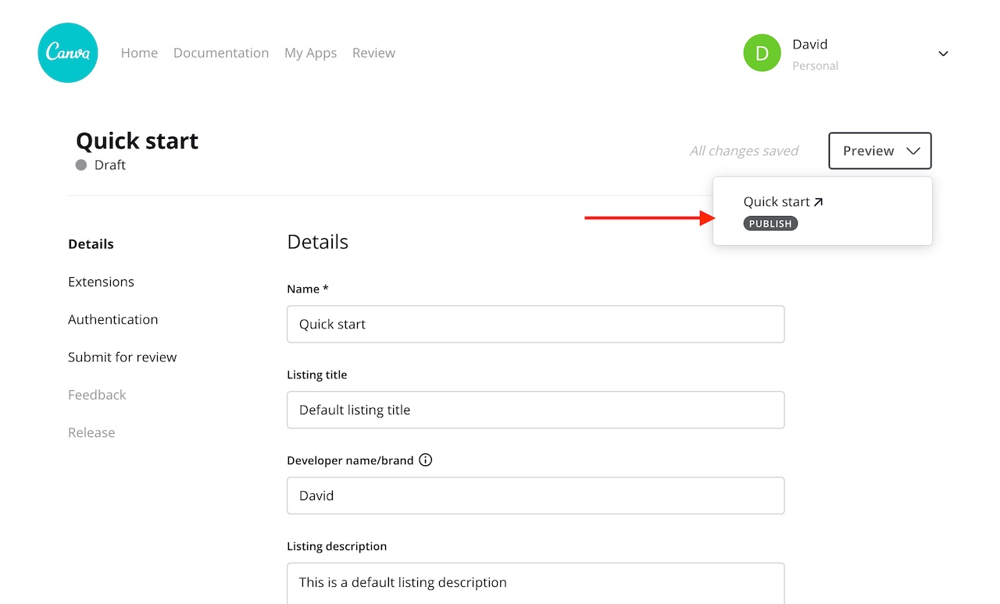
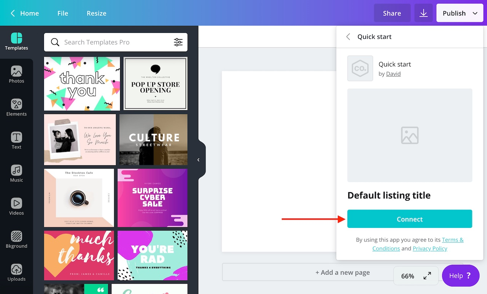
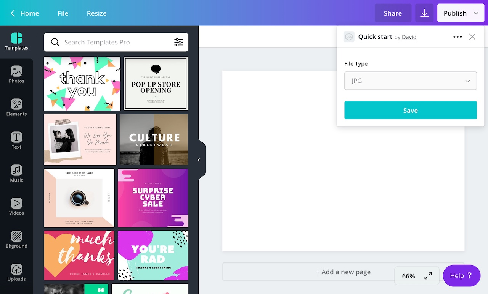
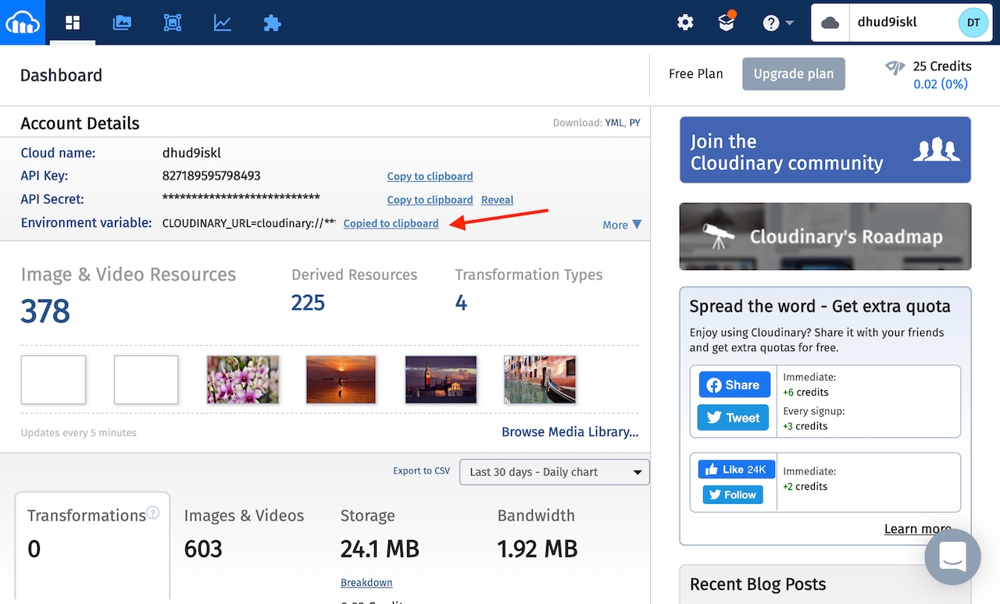
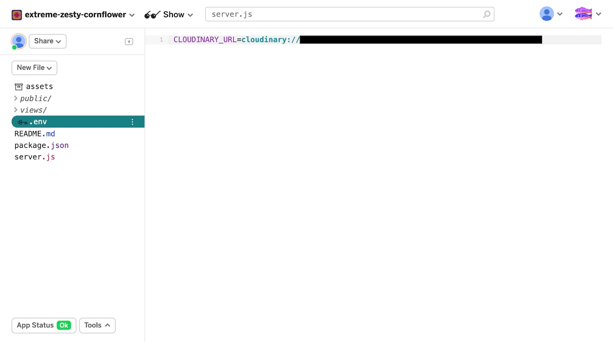
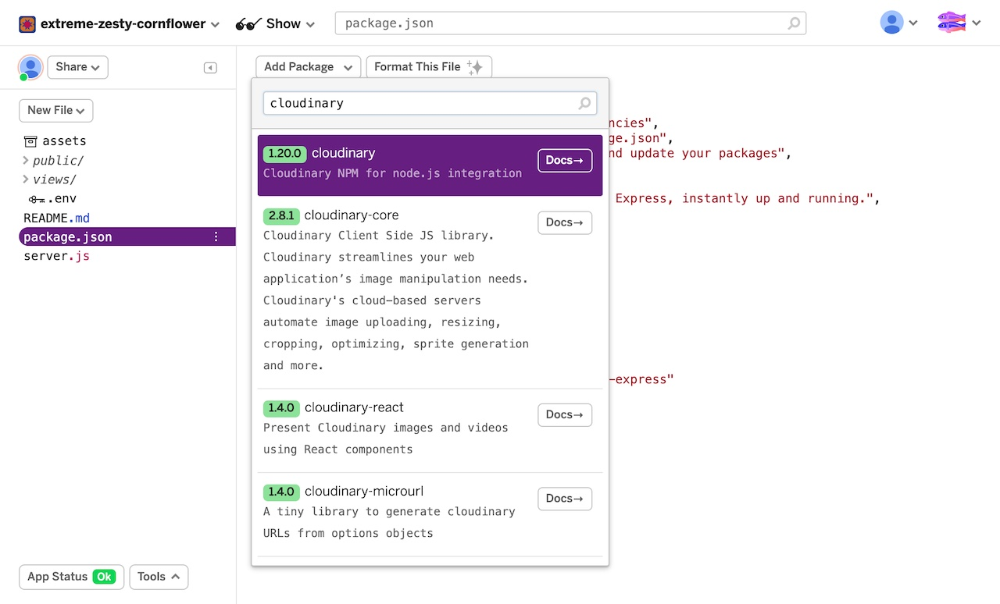
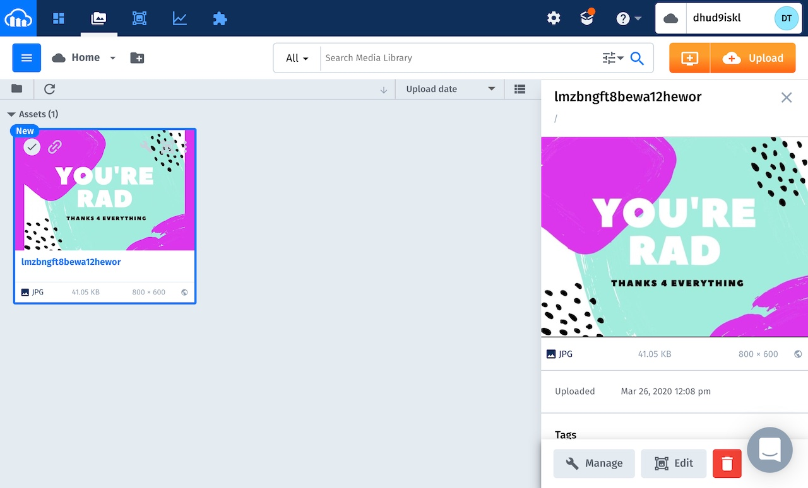

:::note  
 If you're not sure what publish extensions are, refer to the [overview](./../publish-extensions.md).  
:::

In this guide, we're going to create a publish extension that allows users to publish their designs to [Cloudinary](https://cloudinary.com), a digital asset management tool.



You will learn how to:

- create a publish extension via the Developer Portal
- setup a REST API that handles requests from Canva
- upload a user's design to a destination platform

Let's begin.

## Prerequisites

This guide assumes experience with:

- REST APIs
- Node.js
- Express.js

## Step 1: Setup a web server

At its most basic, a publish extension is a REST API. Canva expects this API to have routes with certain paths and for those routes to provide responses with certain shapes.

There are many ways to create and deploy a REST API. To keep things simple though, we're going to use [Glitch](https://glitch.com) -- a web-based editor for creating and deploying Node.js apps. Glitch is free and registration is not required.

To create a Glitch project:

1.  Visit [glitch.com](https://glitch.com).
2.  Click **New Project**.
3.  From the dropdown, select **hello-express**.

When the Glitch editor launches, open the `server.js` file and delete the existing code. Then, to create a simple web server, copy and paste the following code into the file:

```javascript
const express = require("express");
const app = express();

app.use(express.json());

// Routes go here

app.listen(process.env.PORT || 3000);
```

To access the URL of this server:

1.  Click **Share**.
2.  Click **Live App**.
3.  Click **Copy**.

You'll need this URL when configuring the extension.



## Step 2: Create an app via the Developer Portal

1.  Log in to the Developer Portal.
2.  Click **Your apps**.
3.  Click **Create an app**.
4.  In the **App name** field, enter a name for the app.
5.  Agree to the [terms and conditions](https://about.canva.com/policies/developer-terms/).
6.  Click **Create app**.

## Step 3: Add a publish extension to the app

For an app to do something, it needs to include one or more _extensions_. An extension is what hooks into the Canva editor and provides users with content or functionality.

To add a publish extension to the app, click **Publish**.



In the form that appears:

1.  Enter a description into the **Short description** field.
2.  Select the **Default** listing layout.
3.  Select the **JPG** and **PNG** checkboxes.
4.  Enter a **Max number of pages** of at least **1**.
5.  Copy the server address of the app into the **Endpoint URL** field.

Any changes to the form will be saved automatically.

## Step 4: Preview the extension in the Canva editor

1.  Click **Preview**.

2.  Select the extension from the dropdown list.

    

    The Canva editor will open in a new tab.

3.  Click **Connect**.

    

Your extension will load and should look something like this:



:::note  
 You only have to connect the extension once. On return visits, the extension will be immediately available via the menu.  
:::

## Step 5: Upload the user's design

When a user opens a publish extension and clicks the **Save** button, Canva sends a `POST` request to:

```bash
<endpoint_url>/publish/resources/upload
```

The purpose of this request is to upload the user's design to the destination platform.

To receive these requests, create a route with the `app.post` method:

```javascript
app.post("/publish/resources/upload", async (request, response) => {
  // Upload the user's design
});
```

The body of the request is a JSON object that contains all of the necessary information to upload the design:

```json
{
  "user": "AUQ2RUzug9pEvgpK9lL2qlpRsIbn1Vy5GoEt1MaKRE=",
  "brand": "AUQ2RUxiRj966Wsvp7oGrz33BnaFmtq4ftBeLCSHf8=",
  "label": "PUBLISH",
  "assets": [
    {
      "url": "https://s3.amazonaws.com/.../49-04fa92cbfbf8.jpg",
      "type": "JPG",
      "name": "0001-144954.jpg"
    }
  ]
}
```

To publish designs to a Cloudinary account:

1.  Register for an account at [cloudinary.com](https://cloudinary.com)

2.  Beside the **Environment variable** field, click **Copy to clipboard**.

    

3.  Paste the **Environment variable** into the Glitch project's `.env` file.

    

4.  Add the `cloudinary` package to the project:

    1.  Open the `package.json` file.
    2.  Click **Add Package**.
    3.  Search for "cloudinary".
    4.  Click the first result.

    

Back in the `server.js` file, import the `cloudinary` package:

```javascript
const cloudinary = require("cloudinary");
```

Then, inside the route, loop through the user's assets:

```javascript
for (let asset of request.body.assets) {
  // Upload the asset
}
```

For each asset, call the `upload` method, passing through the URL of the asset as the first and only argument:

```javascript
for (let asset of request.body.assets) {
  cloudinary.v2.uploader.upload(asset.url);
}
```

After the loop, indicate that the upload was successful by calling the `response.send` method

```javascript
response.send({
  type: "SUCCESS",
});
```

At this point, the `/publish/resources/upload` route should look like this:

```javascript
app.post("/publish/resources/upload", async (request, response) => {
  for (let asset of request.body.assets) {
    cloudinary.v2.uploader.upload(asset.url);
  }

  response.send({
    type: "SUCCESS",
  });
});
```

After making these changes, select the extension from the **Publish** menu and click **Save**.


The design will be uploaded to the Cloudinary account.



This is the complete code for the extension:

```javascript
const cloudinary = require("cloudinary");
const express = require("express");
const app = express();

app.use(express.json());

app.post("/publish/resources/upload", async (request, response) => {
  for (let asset of request.body.assets) {
    cloudinary.v2.uploader.upload(asset.url);
  }

  response.send({
    type: "SUCCESS",
  });
});

app.listen(process.env.PORT || 3000);
```

## Next steps

You can accomplish a lot more with a publish extension than what we've covered in this guide. To learn more, check out the following topics:

- [Layouts](./default-layout.md)
- [Pagination](./pagination.md)
- [Search](./search.md)

If you have any questions, you can also [raise a support ticket](https://canvadev.atlassian.net/servicedesk/customer/portal/8) with the Canva Apps team.
