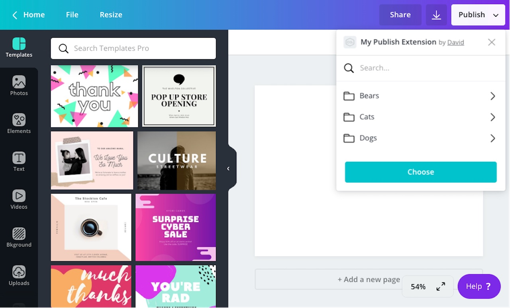

## Enabling search

By default, publish extensions don't support search. You need to enable the feature.

To enable search for a publish extension:

1.  Navigate to an app via the Developer Portal
2.  On the **Extensions** page, expand the **Publish** panel.
3.  Select the **Display search field** checkbox.

:::note  
 A publish extension can only support search if it uses the [List](./list-layout.md) or [Nested](./nested-layout.md) layout.  
:::

## Receiving search requests

When a user performs a search, Canva sends a `POST` request to the following URL:

```bash
<endpoint_url>/publish/resources/find
```

This is the same URL that Canva sends requests to when requesting images and containers. The only difference is that the body of this request includes a `query` property that contains the user's search query:

```json
{
  "user": "AUQ2RUzug9pEvgpK9lL2qlpRsIbn1Vy5GoEt1MaKRE=",
  "brand": "AUQ2RUxiRj966Wsvp7oGrz33BnaFmtq4ftBeLCSHf8=",
  "label": "PUBLISH",
  "limit": 100,
  "type": "IMAGE",
  "locale": "en-US",
  "query": "funny memes",
  "preferredThumbnailHeight": 100,
  "preferredThumbnailWidth": 100
}
```

## Detecting when a user performs a search

When a `POST` request is _not_ triggered by a search, the `query` property is `null`. You can therefore detect when a user has performed a search by checking if the value of the `query` property is `null`:

```javascript
app.post("/publish/resources/find", async (request, response) => {
  if (request.body.query) {
    // the user has performed a search
  } else {
    // the user has not performed a search
  }
});
```

## Responding to search requests

When a user performs a search, a publish extension should return a `"SUCCESS"` response that includes resources relevant to the user's query:

```json
{
  "type": "SUCCESS",
  "resources": []
}
```

:::note  
 If a search returns more results than can be included in a single response, you'll need to support [pagination](./pagination.md) to load the additional resources.  
:::

## Handling containers

The `query` and `containerId` properties are mutually exclusive. If the `query` property is not `null`, the `containerId` will be `null`. This means a user cannot search within a container. You can, however, use a search query to return a filtered list of containers.
