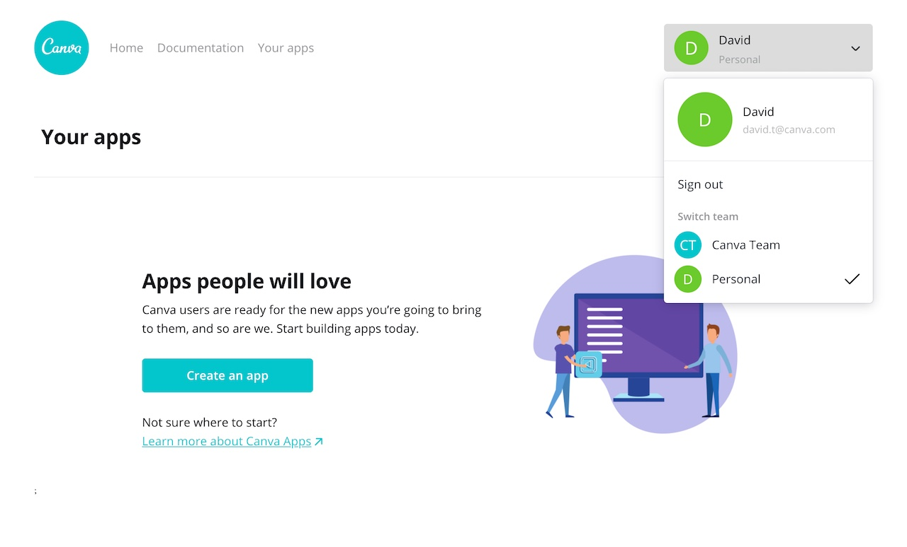

Canva has a [Teams](https://support.canva.com/getting-started/teamwork/canva-teams/) feature that allows users to:

- Share designs with other members of the team
- Maintain consistency across the team's designs with a [Brand Kit](https://support.canva.com/canva-pro/brand-kit-pro/setting-brand-kit/)
- Assign different roles to users, such as Administrator or Template Designer

It's also possible for members of a team to create _team-restricted apps_, which are apps that can only be used by members of that team.

## Team-restricted apps vs. public apps

For the most part, team-restricted apps behave the same as public apps. They're created via the Developer Portal, have access to the same extension points, and need to be approved for release before anyone can start using them. But there are some key differences:

- When a team-restricted app is submitted via the Developer Portal, the Administrator or Owner of the team -- not Canva -- is responsible for reviewing it.
- When a team-restricted app is approved for release, only members of the team can use it.
- A team-restricted app cannot be distributed via the [Apps Directory](https://canva.com/apps).

:::note  
 By default, every Canva user has their own team. This means you don't need to create a team to play around with the team-specific features in the Developer Portal.  
:::

## Selecting a team

You can be a member of multiple teams, so it's important to select the relevant team before attempting to create, use, or review team-restricted apps.

To select a team via the Developer Portal:

1.  Log in to the Developer Portal.
2.  Open the profile switcher.
3.  Choose a team under the **Switch team** heading.

    

Canva will remember the selected team between visits.

:::note  
 If you're only a member of your team (and no other teams), the team will be selected by default and the heading won't be visible.  
:::

## Creating a team-restricted app

1.  Navigate to the **Your apps** page.
2.  Click **Create an app**.
3.  In the **App name** field, enter a name for the app.
4.  Select **Restrict to my team**. Once the app has been created, this choice is irreversible. You cannot convert a team-restricted app into a public app (or vice-versa).
5.  Agree to the terms and conditions.
6.  Click **Create app**.

You'll be taken to the **Details** page for the app, which will confirm that the app is team-restricted. The app will also be labeled as team-restricted on the **Your apps** page.

## Submitting a team-restricted app

1.  Navigate to an app via the **Your apps** page.
2.  Open the **Submit for review** page.
3.  Agree to the terms and conditions.
4.  Click **Submit**.

## Reviewing a team-restricted app

Before a team-restricted app can be used by members of the team, it needs to approved by an Owner or Administrator of the team.

If you're an Owner or Administrator, you can view the apps awaiting review on the **Your apps** page, under the **Your team's apps** heading. Apps awaiting review will be marked with the **Pending review** status.

In the **Actions** column for each app awaiting review, there are three options:

### Preview

Opens the Canva editor in a new tab. You'll need to manually navigate to the app via the **More** tab, **Effects** button, and/or **Publish** menu (depending on the extension types).

### Release

Releases the app to every member of the team. You'll be asked to confirm the release. Once released, the app will become immediately available to the team.

### Reject

Rejects the app. You'll be asked to confirm the rejection and to provide feedback for the developer.
